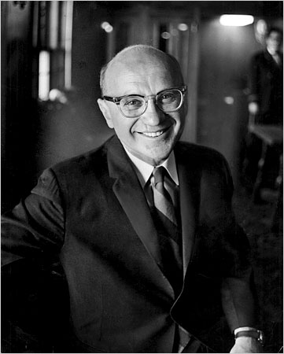
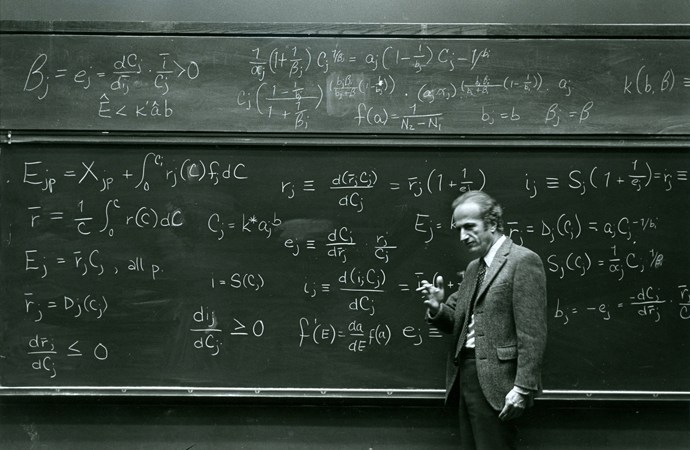

Friedman's essay on the *Methodology of Positive Economics* written in 1953 is a classic exposition of the economic approach to studying problems. It forces us to contend with the the empirical interpretation of Homo Economicus and its role in the normative vs positive applications of economic theory. 

# Milton Friedman



- Born in 1912 in New York City

- BA Rutgers University(1932) MA University of Chicago \(1933\) PhD Columbia University \(1946\)

- Professor at University of Chicago \(1946\-1977\)

- Fellow at the Hoover Institution\,at StanfordUniversity \(1977\-\)

- Mentors:Arthur Burns\, Wesley Mitchell\, Jacob Viner\, Frank Knight

- 1976:Nobel Memorial Prize in Economics

- Influence:in economics -  New Classical Macroeconomics\, in policy  - Ronald Regan and, Margaret  Thatcher \(1980s\)

- Controversy:lecture in Chile in 1975

- He died in San Francisco in 2006

# Scientific contribution

<span style="color:#CC0000">Statistics</span>

Friedman non\-parametric tests  JASA 1937, JASA 1939, AMS 1940

<span style="color:#CC0000">Methodology</span>

“The Methodology of Positive Economics” in _Essays_  _in_  _Positive_  _Economics_ \(1953\)

<span style="color:#CC0000">Consumption</span>

_A_  _Theory_  _of_  _the_  _Consumption Function_ \(1957\)

<span style="color:#CC0000">Monetary</span>  <span style="color:#CC0000">theory\,</span>  <span style="color:#CC0000">history</span>  <span style="color:#CC0000">and</span>  <span style="color:#CC0000">policy</span>

- _A_  _Monetary History_  _of_  _the_  _United_  _States\,_  _1867\-1960_ with A. Schwartz, 1963;

- “The Quantity Theory of Money:A Restatement”, in _Studies_  _in_  _the_  _Quantity_  _Theory_  _of_  _Money_ ed.M\.Friedman\,1956;

- “The Role of Monetary Policy”, (_AER_ 1968); “A Theoretical Framework for Monetary Analysis” ( _JPE_ 1970)

<span style="color:#CC0000">Business</span>  <span style="color:#CC0000">cycles</span>  <span style="color:#CC0000">and</span>  <span style="color:#CC0000">inflation</span>

- “Money and business cycles” with A. Schwartz (_RES_,1963)
- _Monetary_  _Trends_  _in_  _the_  _US_  _and the_  _UK_ with A. Schwartz,1982;

- “Inflation and Unemployment” (_JPE_ 1977)

<span style="color:#CC0000">Ideology\,</span>  <span style="color:#CC0000">Pop</span>

- _Capitialism and_  _Freedom_ (1962)
- _Free_  _to_  _Choose_ with R Friedman, 1980)

# The “Normative” Friedman

Later in Freidman's career, he became a popuar voice for economics in the mainstream media, and would engage with large and broad audienecs "head-on" for live policy debates. He thus took a normative view of policy - what types of policies should be enacted - based on his understanding of the positive predictions from economic theory. 

In addition to being a towering intellect, he was a fierce debater and orator of economics. Here is a famous discussion he gave on the power of prices in a market economy as a means to efficiently coordinated the multitude of economic decisions that are linked together in an economy. 

```{r}
vembedr::embed_youtube("67tHtpac5ws")
```

We thus see his normative leanings towards market as drivers of overall efficiency - a topic which continues today to be hotly debated. In this normative stance, Homo Economicus was a means to an end - a way to reach conclusions about the effect of economic policies

# The revival of the homo economicus

- Idea of _homo_  _economicus_ (Mill 1836; Robbins 1932)

- Keynes (1936): alternative views:

    - _animal_  _spirits_

    - _fundamental_  _psychological_  _law_

- Friedman:revivalof <span style="color:#009900">rational</span>  <span style="color:#009900">behaviour</span> in economics

    - concept of “permanent income” in consumption

    - rejection of permanent trade-off between inflationa ndunemployment due to expectations of future inflation

# Marshallian methodology

- Friedman was not as radical as the New Classical Macroeconomics (Lucas,Sargent):

    -rejection of Rational Expectation Hypothesis

- _Marshallian_ vs. _Walrasian_  methodology

    - Walrasian perspective: general equilibrium and
 complete micro-foundation in individual optimization; secondary role of empirical evidence

    - Marshallian perspective: partial equilibrium
    - theory as “an engine for the discovery of concrete truth” (Marshall1885)
    - importance of empirical economics

- Friedman considered himself a <span style="color:#009900">Marshallian</span>

# F. 53

**“The Methodology of Positive Economics”**

A forceful\, careful\, and heavily influential essay on the meaning of the methodology of economics\.


<span style="color:#666666"> __CHICAGO\. ECONOMICS 300A\. CORE THEORY\. GARY BECKER\, 1956__ </span>



<span style="color:#666666">\_\_\_\_\_\_\_\_\_\_\_\_\_\_\_</span>

<span style="color:#666666"> __Economics 300A__ </span>  <span style="color:#666666"> __Autumn 1956__ </span>  <span style="color:#666666"> __Reading Assignments by G\. Becker__ </span>

<span style="color:#666666">NOTES:</span>

<span style="color:#666666">1\) A knowledge of the material in George Stigler\,</span>  <span style="color:#666666"> _A Theory of Price_ </span>  <span style="color:#666666">or in Kenneth</span>  <span style="color:#666666">Boulding</span>  <span style="color:#666666">\,</span>  <span style="color:#666666"> _Economic Analysis_ </span>  <span style="color:#666666">\, is a prerequisite\. <br>  </span>  <span style="color:#666666">2\) Readings marked with an asterisk \(*\) are recommended\, not required\.</span>

<span style="color:#666666"> _I\. INTRODUCTION_ </span>

<span style="color:#666666">Friedman\, M\.\,</span>  <span style="color:#666666"> _Lecture Notes_ </span>  <span style="color:#666666">\, pp\. 1\-16\.</span>  <br> <span style="color:#666666">Knight\, F\. H\.\,</span>  <span style="color:#666666"> _The Economic Organization_ </span>  <span style="color:#666666">\, pp\. 1\-37\.</span>  <br> <span style="color:#666666">Friedman\, Milton\, “The New Methodology of Positive Economics\,” in</span>  <span style="color:#666666"> _Essays in Positive Economics_ </span>  <span style="color:#666666">\.</span>  <br> <span style="color:#666666">\*Hayek\, F\. A\.\, “The Use of Knowledge in Society\,”</span>  <span style="color:#666666"> _American Economic Review_ </span>  <span style="color:#666666">\, September 1945\, reprinted in</span>  <span style="color:#666666"> _Individualism and Economic Order_ </span>  <span style="color:#666666">\.</span>  <span style="color:#666666">\*Keynes\, J\. N\.\,</span>  <span style="color:#666666"> _The Scope and Method of Political Economy_ </span>  <span style="color:#666666">\, pp\. 1\-83\.</span>

<span style="color:#666666"> _II\. DEMAND ANALYSIS_ </span>

<span style="color:#666666">Marshall\, A\.\,</span>  <span style="color:#666666"> _Principles of Economics_ </span>  <span style="color:#666666">\, Book III\,</span>  <span style="color:#666666">chs</span>  <span style="color:#666666">\. 2\-4; Book V\,</span>  <span style="color:#666666">chs</span>  <span style="color:#666666">\. 1\-2\.</span>

# F.’s enemies

- 1946-1953: controversy on the “marginalist” theory of the firm

- Hall and Hitch (1939): “Price Theory and Business Behaviour”, _Oxford_  _Economic_  _Papers_

    - survey on how prices emerged within firms
    - rules of thumb inconsistent with the hypothesis of maximization of expected profits
    - psychological mechanisms different from model’s mechanism: <span style="color:#009900">false</span>  <span style="color:#009900">assumptions</span>

- The Rise of Chamberlainian and Walrasian Economics: Monopolistic Competition and General Equilibrium.

Friedman is feeling the Marshallian approach under attack from multiple fronts. As his 1974 self revealed - how do you respond?

“You cannot be sure that you are right unless you understand the arguments against your views better than your opponents do."

## The Methodology of Positive Economics (1953)

Opening line:

<br>
_In_  _his_  _admirable_  _book_  _on The_  _Scope_  _and_  _Method_  _of_  _Political_  _Economy\,_  _John_  _Neville_  _Keynes_  _distinguishes_  _among_  _“a_  <span style="color:#CC0000"> _positive_ </span>  _science_  _\. \. \._  _a_  _body_  _of_  _systematized_  _knowledge_  _concerning_  _what_  _is;_  <span style="color:#CC0000"> _a_ </span>  <span style="color:#CC0000"> _normative_ </span>  _or_  _regulative_  _science_  _\.\.\._  _a_  _body_  _of_  _systematized_  _knowledge_  _discussing_  _criteria_  _of_  _what_  _ought_  _to_  _be_  _\. \. \._  _;_  _an_  <span style="color:#CC0000"> _art_ </span>  _\.\.\._  _a_  _system_  _of_  _rules_  _for_  _the_  _attainment_  _of_  _a_  _given_  _end";_  _comments_  _that_  _“confusion between_  _them_  _is_  _common_  _and_  _has been_  _the_  _source_  _of_  _many_  _mischievous_  _errors";_  _and_  _urges_  _the_  _importance_  _of_  _“recognizing_  _a_  _distinct_  _positive_  _science_  _of_  _political_  _economy”\._

He thus raised the positive-normative distinction, which he continues to discuss

> Normative economics and the art of economics\, on the other hand\, cannot be independent of positive economics\. Any policy conclusion necessarily rests on a prediction about the consequences of doing one thing rather than another\, a prediction that must be based – implicitly or explicitly \- on positive economics\. There is not\, of course\, a one\-to\-one relation between policy conclusions and the conclusions of positive economics; if there were\, there would be no separate normative science\. Two individuals may agree on the consequences of a particular piece of legislation\. One may regard them as desirable on balance and so favor the legislation; the other\, as undesirable and so oppose the legislation\. (page 5)

## The Case for Positive Economics

- Normative versus positive economics

- Policy questions center around “what policy should we _as a society_ enact?”

- In order to answer this we must be able to answer “if we enacted this policy what will happen?”

>I venture the judgment\, however\, that currently in the Western world\, and especially in the United States\, differences about economic policy among disinterested citizens derive predominantly from different predictions about the economic consequences of taking action \- differences that in principle can be eliminated by the progress of positive economics \- rather than from fundamental differences in basic values\, differences about which men can ultimately only fight\.” \(page 7\)


>The ultimate goal of a positive science is the development of a "theory" or\, "hypothesis" that yields valid and meaningful i.e., (not truistic) predictions about phenomena not yet observed\. Such a theory is\, in general\, a complex intermixture of two elements\. In part\, it is a "language" designed to promote "systematic and organized methods of reasoning\.” In part\, it is a body of substantive hypotheses designed to abstract essential features of complex reality\. \(page 7\)

### Translation

Positive Economics consists of two parts:

1. A completely self\-enclosed formal system consisting of assumptions and implications drawn from those assumptions

2. The hypotheses stated in the language of the science that abstracts “essential features” of the reality it purports to explain.

### Popperian perspective

_the_  _only_  _relevant_  _test_  _of_  _the_  _validity_  _of_  _a_  _hypothesis is_  _comparison_  _of_  _its_  _predictions_  _with_  _experience\._  _The hypothesis is_  _rejected_  _if_  _its_  _predictions_  _are_  _contradicted “frequently”_  _or_  _more_  _often_  _than_  _predictions from_  _an  alternative_  _hypothesis;_  _it_  _is_  _accepted_  _if_  _its_  _predictions_  _are_  _not_  _contradicted;_  _great confidence_  _is_  _attached_  _to_  _it_  _if_  _it_  _has_  _survived_  _many_  _opportunities_  _for_  _contradiction\._  _Factual evidence can_  _never_  _“prove”_  _a_  _hypothesis;_  _it_  _can_  _only_  _fail_  _to_  _disprove_  _it\,_  _which_  _is_  _what_  _we_  _generally_  _mean_  _when_  _we_  _say\,_  _somewhat_  _inexactly\,_  _that_  _the hypothesis_  _has been_  _“confirmed”_  _by_  _experience_

## Digression I: logical positivism

- Origin in the Vienna circle of 1920s. Cfr. H\.Feigl\, R\.Carnap\, H\.Reichenbach\, M\.Schlick

- Six tenets or tendencies (cfr\.Hacking1983: 41\-42):

    1. Emphasis upon verification

    2. Pro observation

    3. Anti-cause

    4. Downplaying explanation

    5. Anti\-theoretical entities

    6. To sum up: against metaphysics\!

- <span style="color:#FFFFFF">Popper’s</span>  <span style="color:#FFFFFF">variant:</span>  <span style="color:#FFFFFF">falsificationism</span>

Popper emphasized within this tradition two things:

1. _modus_  _tollens_ -  _If P implies Q and Q is false\, then P is false_. (related to  _red _uctio_  _ad absurdum)_

2. Simplicity

## Duhem-Quine problem

> Unfortunately\, we can seldom test particular predictions in the social sciences by experiments explicitly designed to eliminate what are judged to be the most important disturbing influences\. Generally\, we must rely on evidence cast up by the "experiments" that happen to occur…No experiment can be completely controlled\, and every experience is partly controlled\, in the sense that some disturbing influences are relatively constant in the course of it\. (page 10)

### Translation

- The predictions that arise from economic theory are typically “ceteris paribus” statements\.

- Holding all else equal\, a change in X causes a change in Y#

- Unfortunately the data never “holds all else equal” – it is always full of “disturbing influences”

- The inability to conduct “randomized experiments” makes these disturbing influences especially hard for taking theory to data\.

> The difficulty in the social sciences of getting new evidence for this class of phenomena and of judging its conformity with the implications of the hypothesis makes it tempting to suppose that other\, more readily available\, evidence is equally relevant to the validity of the hypothesis\-to suppose that hypotheses have not only "implications" but also "assumptions" and that the conformity of these "assumptions" to "reality" is a test of the validity of the hypothesis different from or additional to the test by implications\. This widely held view is fundamentally wrong and productive of much mischief\. \(page 14\)

## The F-twist

<span style="color:#CC0000"> _Truly_ </span>  <span style="color:#CC0000"> _important_ </span>  <span style="color:#CC0000"> _and_ </span>  <span style="color:#CC0000"> _significant_ </span>  <span style="color:#CC0000"> _hypotheses_ </span>  <span style="color:#CC0000"> _will_ </span>  <span style="color:#CC0000"> _be_ </span>  <span style="color:#CC0000"> _found_ </span>  <span style="color:#CC0000"> _to_ </span>  <span style="color:#CC0000"> _have_ </span>  <span style="color:#CC0000"> _“assumptions"that_ </span>  <span style="color:#CC0000"> _are_ </span>  <span style="color:#CC0000"> _wildly_ </span>  <span style="color:#CC0000"> _inaccurate_ </span>  <span style="color:#CC0000"> _descriptive_ </span>  <span style="color:#CC0000"> _representations_ </span>  <span style="color:#CC0000"> _of_ </span>  <span style="color:#CC0000"> _reality\,_ </span>  <span style="color:#CC0000"> _and\,_ </span>  <span style="color:#CC0000"> _in_ </span>  <span style="color:#CC0000"> _general\,_ </span>  <span style="color:#CC0000"> _the_ </span>  <span style="color:#CC0000"> _more_ </span>  <span style="color:#CC0000"> _significant_ </span>  <span style="color:#CC0000"> _the_ </span>  <span style="color:#CC0000"> _theory\,_ </span>  <span style="color:#CC0000"> _the_ </span>  <span style="color:#CC0000"> _more_ </span>  <span style="color:#CC0000"> _unrealistic  the_ </span>  <span style="color:#CC0000"> _assumptions_ </span>  <span style="color:#CC0000"> _in_ </span>  <span style="color:#CC0000"> _this_ </span>  <span style="color:#CC0000"> _sense\._ </span>  _The_  _reason_  _is simple\._  _A_  _hypothesis is_  _important_  _if_  _it_  _“explains"much by little\,_  _that_  _is\, if_  _it_  <span style="color:#CC0000"> _abstracts_ </span>  _the_  _common_  _and_  _crucial_  _elements_  _from_  _the mass_  _of_  _complex_  _and_  _detailed_  _circumstances_  _surrounding_  _the_  _phenomena_  _to_  _be_  _explained_  _and_  _permits_  _valid_  _predictions_  _on the_  _basis_  _of_  _them_  _alone\._  _To_  _be_  _important\,_  _therefore\,_  _a_  _hypothesis_  _must_  _be_  <span style="color:#CC0000"> _descriptively_ </span>  <span style="color:#CC0000"> _false_ </span>  _in_  _its_  _assumptions;_  _it_  _takes_  _account_  _of\,_  _and accounts_  _for\,_  _none_  _of_  _the_  _many_  _other_  _attendant_  _circumstances\,_  _since_  _its_  _very_  _success_  _shows_  _them_  _to_  _be_  _irrelevant_  _for_  _the_  _phenomena_  _to_  _be_  _explained\_ (F53: 14\-15\, emphasis added)

### Digression II: realism vs. instrumentalism

- Problem of <span style="color:#009900">unobservables</span> :lack of _direct_ sensory access to theoretical entities in science (e\.g\.electrons\,quarks\,radiowaves\,viruses\,demandcurve\,permanentincome\,velocityofmoney)

- <span style="color:#009900">Realism</span> : scientific theories \(should\) deliver true description of the world (or of some structure  of the world),including the unobservable part

    - emphasis on description and explanation

- <span style="color:#009900">Instrumentalism</span> : we are in no position to get true descriptions of the world: theories are useful instruments  to  generate predictions

    - emphasis on prediction and manipulation

### Realism vs. realisticness

- In economics  it is particularly important to distinguish _realism_ \,which emphasizes the  possibility of identifying faithful  description of some structures of  reality\,from the degree of <span style="color:#CC0000">accurateness</span> of the description\.

- Uskali Mäki (1994\, 1998\)  calls  descriptive accuracy _realisticness_

- Thus one can be realist with respect to some model or theory without emphasizing its realisticness

- The importance of __abstractions__  __and__  __idealizations__

### F. on the realism of the  assumptions

_the relevant_  _question_  _to_  _ask_  _about_  _the “assumptions”_  _of_  _a_  _theory is_  _not_  _whether_  _they_  _are_  _descriptively_  _“realistic\,”_  _for_  _they_  _never_  _are\,_  _but_  _whether_  _they_  _are_  _sufficiently_  _good_  _approximations_  _for_  _the_  _purpose_  _in_  _hand\._  _And_  _this_  _question_  _can_  _be_  _answered_  _only_  _by_  _seeing_  _whether the theory works\,_  _which_  _means whether_  _it_  _yields_  _sufficiently_  _accurate_  _predictions\. (F53:15)

## First example: Galilean experiment

_It_  _is an_  _accepted_  _hypothesis_  _that_  _the_  _acceleration_  _of_  _a_  _body_  _dropped_  _in_  _a_  _vacuum_  _is_  _a_  _constant_  _\- g\,_  _or_  _approximately 32_  _feet_  _per second per second_  _on  the_  _earth_  _\- and is_  _independent_  _of_  _the_  _shape_  _of_  _the_  _body\,_  _the_  _manner_  _of_  _dropping_  _it\,_  _etc\._  _This_  _implies_  _that_  _the_  _distance traveled_  _by_  _a_  _falling_  _body_  _in_ _any_  _specified_  _time_  _is_  _given by_  _the formula s_ = (1/2)gt^2 _\,_  _where_  _s is the_  _distance_ _traveled_  _in_  _feet_  _and_  _t_  _is_  _time_  _in_  _seconds\._  _The_  _application_  _of_  _this_  _formula to_  _a_  _compact_  _ball dropped_  _from_  _the_  _roof_  _of_  _a_  _building_  _is_  _equivalent_  _to_  _saying_  _that_  _a_  _ball_  _so_  _dropped behaves_  <span style="color:#CC0000"> _as_ </span>  <span style="color:#CC0000"> _if_ </span>  _it_  _were_  _falling_  _in_  _a_  _vacuum\._  _Testing_  _this_  _hypothesis_  _by_  _its_  _assumptions_  _presumably means_  _measuring_  _the_  _actual_  _air_  _pressure_  _and_  _deciding_  _whether_  _it_  _is_  _close_  _enough to_  _zero\._  (F53: 16\-17\, emphasis added)

_This_  _example_  _illustrates_  _both_  _the_  _impossibility_  _of_  _testing_  _a_  _theory_  _by_  _its_  _assumptions_  _and_  _also_  _the_  _ambiguity_  _of_  _the_  _concept_  _“the_  _assumptions_  _of_  _a_ _theory\.”_  _The formula s_ =(1/2) gt^2 _is valid_  _for_  _bodies_  _falling_  _in_  _a_  _vacuum_  _and_  _can_  _be_  _derived_  _by_  _analyzing_  _the_  _behavior_  _of_  _such_  _bodies\._  _It_  _can_  _therefore_  _be_  _stated:_  _under_  _a_  _wide_  _range_  _of_  _circumstances\,_  _bodies_  _that_  _fall_  _in_  _the_  _actual_  _atmosphere_  _behave as_  _if_  _they_  _were_  _falling_  _in_  _a_  _vacuum\._ _The formula is_  _accepted_  _because_  _it_  _works\,_  _not_  _because_  _we live_  _in_  _an_  _approximate_  _vacuum_  _\- whatever_  _that_  _means\._ (F53: 17\-18)

### Translation

- A Galilean Assumption: Air Pressure = 0

- Role of assumption: All forces other than gravitation = 0

- Idealizes gravity as the sole cause of the motion of a falling body\, assuming all other forces are powerless\.

- A Neoclassical Assumption: Producers and traders pursue maximum expected returns

- Role of assumption: All other motives except the maximization motive have zero strength\.


## Second example: an evolutionary argument

_Consider_  _the_  _density_  _of_  _leaves_  _around_  _a_  _tree\._  _I_  _suggest_  _the hypothesis_  _that_  _the_  _leaves_  _are_  _positioned_  <span style="color:#CC0000"> _as_ </span>  <span style="color:#CC0000"> _if_ </span>  <span style="color:#CC0000"> _each_ </span>  <span style="color:#CC0000"> _leaf_ </span>  <span style="color:#CC0000"> _deliberately_ </span>  <span style="color:#CC0000"> _sought_ </span>  <span style="color:#CC0000"> _to_ </span>  <span style="color:#CC0000"> _maximize_ </span>  <span style="color:#CC0000"> _the_ </span>  <span style="color:#CC0000"> _amount_ </span>  <span style="color:#CC0000"> _of_ </span>  <span style="color:#CC0000"> _sunlight_ </span>  <span style="color:#CC0000"> _it_ </span>  <span style="color:#CC0000"> _receives_ </span>  _\,_  _given_  _the position_  _of_  _its_  _neighbors\,_  <span style="color:#CC0000"> _as_ </span>  <span style="color:#CC0000"> _if_ </span>  <span style="color:#CC0000"> _it_ </span>  <span style="color:#CC0000"> _knew_ </span>  <span style="color:#CC0000"> _the_ </span>  <span style="color:#CC0000"> _physical_ </span>  <span style="color:#CC0000"> _laws_ </span>  _determining_  _the_  _amount_  _of_  _sunlight_  _that_  _would_  _be_  _received_  _in_  _various positions and_  _could_  _move rapidly_  _or_  _instantaneously_  _from_  _any_  _one_  _position to_  _any_  _other_  _desired_  _and unoccupied position\._  _Now_  _some_  _of_  _the_  _more_  _obvious_  _implications_  _of_  _this_  _hypothesis_  _are_  _clearly_  _consistent_  _with_  _experience:_  _for_  _example\,_  _leaves_  _are_  _in_  _general_  _denser_  _on the_  _south_  _than_  _on the_  _north_  _side_  _of_  _trees_  _but\,_  _as_  _the hypothesis implies\,_  _less_  _so or_  _not_  _at_  _all_  _on the_  _northern_  _slope_  _of_  _a_  _hill_  _or_  _when_  _the_  _south_  _side_  _of_  _the_  _trees_  _is_  _shaded_  _in_  _some_  _other_  _way\._  _\.\.\. the hypothesis_  _does_  _not_  _assert_  _that_  _leaves_  _do_  _these_  _things_  _but_  _only that_  _their_  _density_  _is the_  _same_  <span style="color:#CC0000"> _as_ </span>  <span style="color:#CC0000"> _if_ </span>  _they_  _did\. Despite the_  _apparent_  _falsity_  _of_  _the “assumptions”_  _of_  _the hypothesis\,_  _it_  _has_  _great_  _plausibility_  _because of_  _the_  _conformity_  _of_  _its_  _implications_  _with_  _observation_\. (F53: 19\-20, emphasis added)

## Third example: the billiard player

_Consider_  _the_  _problem_  _of_  _predicting the shots_  _made_  _by_  _an expert_  _billiard_  _player\._  _It_  _seems_  _not_  _at_  _all unreasonable_  _that_  _excellent predictions_  _would_  _be_  _yielded_  _by_  _the hypothesis_  _that_  _the_  _billiard player_  _made_  _his shots_  <span style="color:#CC0000"> _as_ </span>  <span style="color:#CC0000"> _if_ </span>  _he_  _knew_  _the_  _complicated_  _mathematical formulas_  _that_  _would_  _give the_  _optimum_  _directions_  _of_  _travel\,_  _could_  _estimate_  _accurately_  _by_  _eye_  _the_  _angles\, etc\.\,  describing_  _the_  _location_  _of_  _the_  _balls\,_  _could_  _make_  _lightning_  _calculations from_  _the formulas\, and_  _could_  _then_  _make_  _the_  _balls_  _travel_  _in_  _the_  _direction indicated_  _by_  _the_  _formulas\._ (F53:21)

>Now\, of course\, businessmen do not actually and literally solve the system of simultaneous equations in terms of which the mathematical economist finds it convenient to express this hypothesis\, any more than leaves or billiard players explicitly go through complicated mathematical calculations… The billiard player\, if asked how he decides where to hit the ball\, may say that he “just figures it out” but then also rubs a rabbit’s foot just to make sure; and the businessman may well say that he prices at average cost\, with of course some minor deviations when the market makes it necessary\. The one statement is about as helpful as the other\, and neither is a relevant test of the associated hypothesis\. 

## Bottom line

_individual firm_  _behave as_  _if_  _they_  _were_  _seeking_  _rationally to_  _maximize_  _their_  _expected_  _returns_  _\.\.\.and_  _had_  _full_  _knowledge_  _of_  _the_  _data needed_  _to_  _succeed_  _in_  _this_  _attempt;_  _as_  _if\,_  _that_  _is\,_  _they knew_  _the relevant_  _cost_  _and demand_  _functions\,_  _calculated_  _marginal_  _cost_  _and marginal revenue_  _from_  _all_  _actions_  _open_  _to_  _them\,_  _and pushed_  _each_  _line_  _of_  _action_  _to the_  _point_  _at_  _which_  _the  relevant marginal_  _cost_  _and marginal revenue_  _were_  _equal\._  (F53:21)

## F.’s ambiguities

- It would not be fair to dub F\. as an instrumentalist

- He swings between realism (*but anti\-realisticness*) and instrumentalism

- Especially if we judge F53 vis\-à\-vis Friedman and Schwartz (1963) and his professed Marshallian  methodology

_Marshall_  _took_  _the world_  _as_  _it_  _is; he_  _sought_  _to_  _construct_  _an_  _“engine”_  _to  analyze_  _it\, not_  _a_  _photographic_  _reproduction_  _of_  _it_  (F53:35)


## Conclusion

- The relevant hypothesis is: “I can treat the data of interest AS IF it were generated by the ideal types contained in my model”\.

-  A reasonable starting point if model was generated by isolating essential features of reality in the first place\.

## How can we test our model of Homo Economicus

Imagine the following question was asked to a decision maker:

- You won a free ticket to an Eric Clapton concert\.

- Bob Dylan is playing on the same night and is your most attractive alternative\.

- Ticket to see Dylan is $40

- You would be willing to pay up to $50 to see Dylan

- No other costs of seeing either performer

- Willing to pay $50 to see Dylan

- Cost of Dylan ticket = $40

Based on this information\, what is the opportunity cost of seeing Clapton?

a. $0

b. $10

c. $40

d. $50


**7\.4% of 270** undergrads who had previously taken a course in economics answered the question correctly

**17\.2% of 88** undergrads who had never taken a course in economics answered the question correctly

What would Friedman say to this data as a test against Homo Economicus

