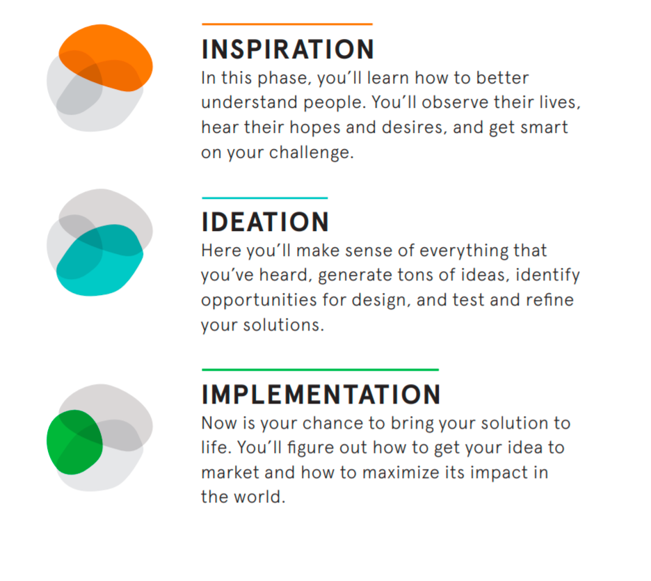
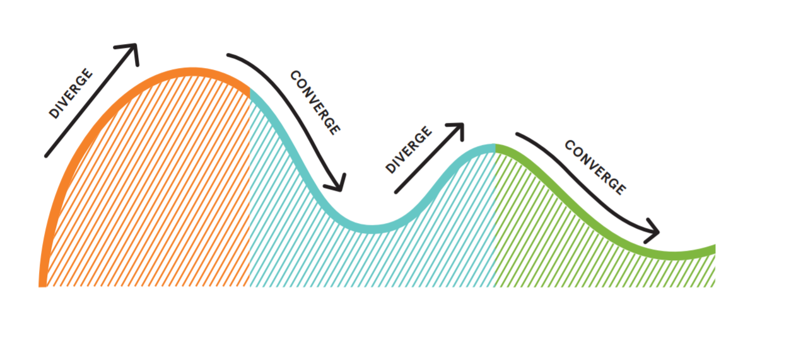
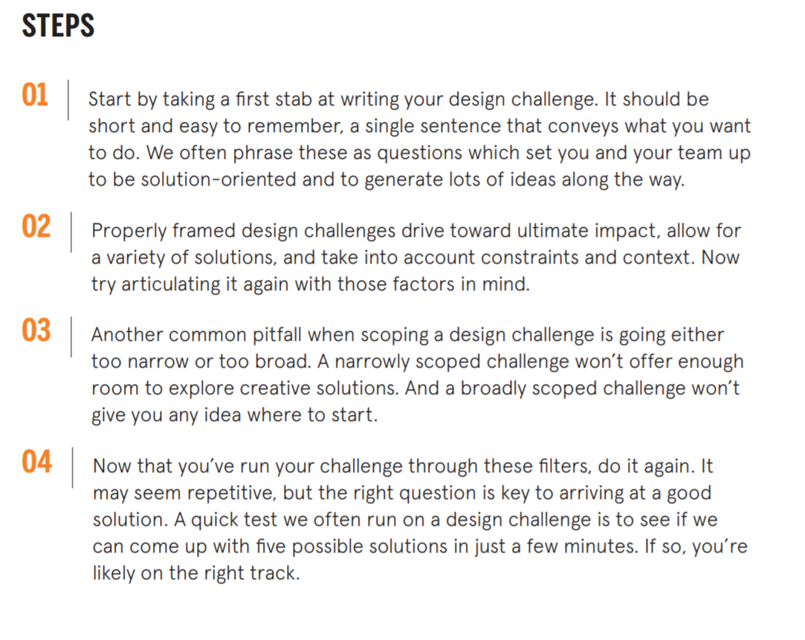
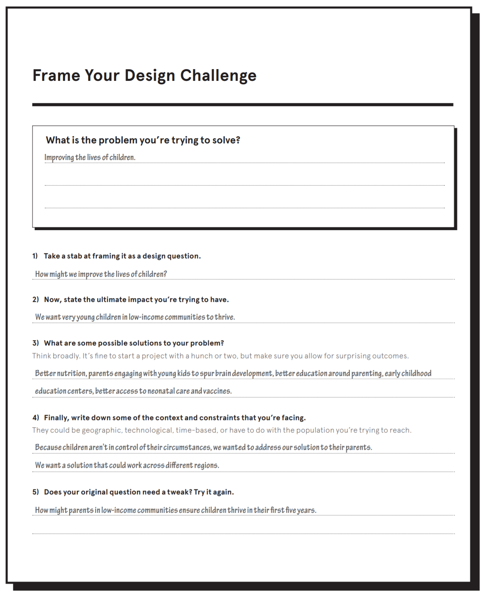

## Introduction

Our previous posts and discussion have yielded 3 key realities for human decision making:


1. <font color = "red"> Economists model human decisions using the predictions of Homo Economicus. </font> Homo Economicus exhibits at least seven central cognitive capabilities that are present in every decision it makes. The model straddles the line between a positive science and a normative science. 

2. <font color = "red"> Homo Economicus is a useful approximation, but there is more to human decisions than the mental operations of Homo Economicus. </font> Homo Economicus maps to our "slow thinking" selves - e.g., System 2. However System 1, our fast thinking selves, is in the drivers seat for many choices and decisions and there are systematic differences between the behavior of System 1 and Homo Economicus. 

3. <font color = "red"> The wedge between Homo Economicus and System 1 creates an opportunity to improve the efficiency of economic decisions in the real world. </font> However to influence behavior we will need to convince our "System 1" selves to act even if our "System 2" reasoning abilities are convinced. 


As we will discover, one of the key limitations of System 1 is its challenge in processing data - there is a considerable distance between our **"intutive statistician"** selves and the formal statistical/econometric principles. 

Data Science on the other hand is a tool for presenting and conveying the value of data to decision makers to influence their decisions. 

This defines the scope of our semester projecr. 

We will engage in a process of defining a decision problem, and iteratively working our way to data solution and and the creation of a simple mock up that creates value to a user, a human!

To design a solution that is useful to humans, we will thus engage in a process known as **human centered design**. 

The process is laid out in the guidebook from *IDEO.org*, which we will be following, and the relevant sections posted on Perusall. The key steps are:

```{r}

```

A key aspect of the process the guidebook highlights is its non-linearity:

> Human-centered design isn’t a perfectly
linear process, and each project invariably
has its own contours and character. But no
matter what kind of design challenge you’ve
got, you’ll move through three main phases:
Inspiration, Ideation, and Implementation.
By taking these three phases in turn, you’ll
build deep empathy with the communities
and individuals you’re designing for; you’ll
figure out how to turn what you’ve learned
into a chance to design a new solution; and
you’ll build and test your ideas before finally
putting them out into the world.

Another important part of the process is to work in teams and building quickly, before you know or understand exactly what you are building!

>To maintain creativity and
energy, we always work in teams. To keep
our thinking generative, sharp, and because
it helps us work things through, we always
make tangible prototypes of our ideas. And
because we rarely get it right the first time,
we always share what we’ve made, and iterate
based on the feedback we get. 

The central teaching of the guidebook: **Trust the process!**

> Human-centered design is a unique approach
to problem solving, one that can occasionally
feel more like madness than method—but
you rarely get to new and innovative solutions
if you always know precisely where you’re
going. The process is designed to get you to
learn directly from people, open yourself up
to a breadth of creative possibilities, and then
zero in on what’s most desirable, feasible,
and viable for the people you’re designing
for. You’ll find yourself frequently shifting
gears through the process, and as you work
through its three phases you’ll swiftly move
from concrete observations to highly abstract
thinking, and then right back again into the
nuts and bolts of your prototype.

The journey is best described as a **"converge-diverge"** cycle, where you go big in your thinking, dial down into specifics and practicality, look back at the big picture, and iterate. 

```{r, echo = FALSE}

```


## Milestone 1: Framing a  Design Challenge

We want to design solutions to improve a decision. The first step - arguably the hardest - is to define a problem or question that is worth solving! The guidebook refers to this as **Framing the Design Challenge*. 

Your task is to work with your team and frame a design challenge. For now you can imagine hypothesizing that there is a decision inefficiency that can be aided with appropriate application of data and imagine constructing a solution in an unconstrained way. The steps for this milestone are laid out as:

```{r, echo = FALSE}

```

Your can iterate on this process using the structure of the worksheet provided in the guidebook. 

```{r, echo = FALSE}

```


Your final artifact for this milestone phase is a document that mimics this structure but adapted to the design problem of improving a decision - e.g., the problem you are solving is to improve a decision "in the wild" based on your perceived gap between the intuitive decisions and what "should" happen if our Homo Economicus selves could freely operate. 

We will use google docs for this round and evolve our projects to Rmarkdown in subsequent phases. Your TA wil send links to each group for the link to a document where you can develop this phase's milestone. 


