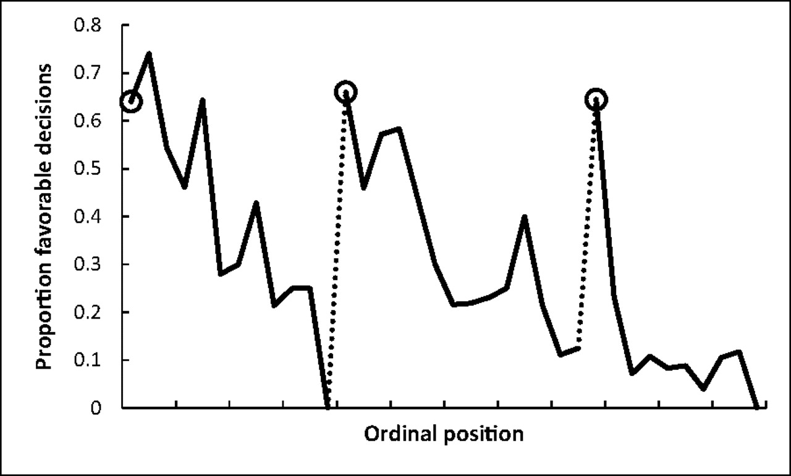
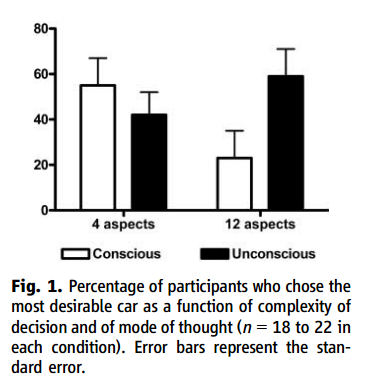
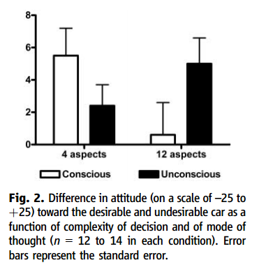
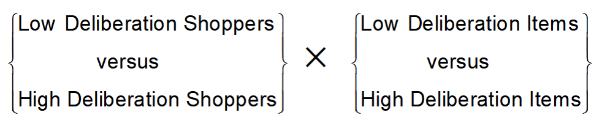
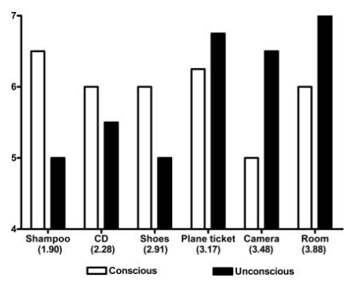

# Introduction

In the 1970s believed that people are generally rational, with strong
emotions being the cause departure from rationality. Since then
behavioral psychologists and economists have developed a different view
based on an analysis of how we think. TFS describes two systems of
thought that synthesizes this understanding of the mind's dual
operations: System 1 and System 2. These two Systems play the role of
distinct characters in the book, with unique personality attributes who
both cooperate yet compete for control of our attention and behavior.

To isolate the behavior of System 1, consider the picture

{width="6.5in"
height="3.4368055555555554in"}

In fairly effortless manner, we are able to surmise several facts about
this woman: she is angry and quite likely to say unkind words in a loud
and harsh voice. This assessment came to mind instantaneously without
effort, and is an example of fast thinking.

On the other hand, consider the question

17 X 24 =

We can immediately identify this as a multiplication problem, and are
aware there exists a paper and pencil solution. We can recognize that
12,000 is too big and 123 is too small to be the answer. However,
without further thought it is unlikely that we can surmise the correct
solution was not 568. In order to carry out the analysis a different
mode of thinking needs to ensue -- slow thinking. You will retrieve from
memory a cognitive program learned in school for carrying out
multiplication. You effortfully need to carry out a sequence of steps,
retaining numbers in working memory to hold onto intermediate results
which feels like a temporary strain. The overall process of mental work
is deliberate, effortful, and orderly, a prototype of slow thinking. The
effects of slow thinking were not only felt in the mind -- it had
physical impact on you -- your muscles would have tensed, blood pressure
rose, heart rate increased, and pupils dilated, which all would have
relaxed upon when you found the right answer.

# System 1 and System 2

Other examples of System 1 and System 2 in action include:

Table 1

+----------------------------------+----------------------------------+
| **System 2**                     | **System 1**                     |
+==================================+==================================+
| > Brace for the starter gun in a | > Detect one object is more      |
| > race                           | > distant than another           |
+----------------------------------+----------------------------------+
| > Focus attention on the clowns  | > Orient the source of a sudden  |
| > in a circus                    | > sound                          |
+----------------------------------+----------------------------------+
| > Look for a woman with white    | > Complete the phrase "bread and |
| > hair                           | > ..."                           |
+----------------------------------+----------------------------------+
| > Search memory to identify a    | > Make a "disgust face" when     |
| > surprising sound               | > shown a horrible picture       |
+----------------------------------+----------------------------------+
| > Maintain a faster walking      | > Detect hostility in a voice    |
| > speed than is natural for you  |                                  |
+----------------------------------+----------------------------------+
| > Monitor the appropriateness of | > Answer to 2 + 2 =?             |
| > your behavior in a social      |                                  |
| > situation                      |                                  |
+----------------------------------+----------------------------------+
| > Count the occurrences of the   | > Read words on large billboards |
| > letter *a* in a page of text   |                                  |
+----------------------------------+----------------------------------+
| > Tell someone your phone number | > Drive a car on an empty road   |
+----------------------------------+----------------------------------+
| > Park in a narrow space (for    | > Find a strong move in chess    |
| > most people)                   | > (if you are a chess master)    |
+----------------------------------+----------------------------------+
| > Compare two washing machines   | > Understand simple sentences    |
| > for overall value              |                                  |
+----------------------------------+----------------------------------+
| > Fill out a tax form            | > Recognize that a "meek and     |
|                                  | > tidy soul with a passion for   |
|                                  | > detail" resembles an           |
|                                  | > occupational stereotype.       |
+----------------------------------+----------------------------------+
| > Check the validity of a        |                                  |
| > complex logical argument       |                                  |
+----------------------------------+----------------------------------+

As TFS describes it

-   "*System* 1 operates automatically and quickly, with little or no
    effort or sense of voluntary control"

-   *"System* 2 allocates attention to the effortful mental activities
    that demand it, including complex computations. The operations of
    System 2 are often associated with the subjective experience of
    agency, choice, and concentration".

The key theme of the book is that whereas our self-identities (and the
ideal aspects of Homo Economicus) are bound in the version of our System
2 selves, System 1 in fact drives the lion's share of our everyday
thoughts and actions. A key focus of the book then is to investigate the
specific tendencies of System 1 to reach judgments and make choices
which are fast, often intelligent, but exhibit systematic biases. The
other question the book considers are the capabilities of System 2 that
are directed towards control and the correction of the automatic
processes of System 1.

The key distinguishing characteristics between System 1 and System 2 can
be describe more fully as follows.

  -------------------------------------- ----------------------------------------
  System 1 (Intuitive)                   System 2 (Reflective)

  **[Process Characteristics]{.ul}**\    **[Process Characteristics]{.ul}**\
  Automatic\                             Controlled\
  Effortless\                            Effortful\
  Associative\                           Deductive (formal rules of reasoning)\
  Rapid, parallel\                       Slow, serial\
  Skilled action                         Rule application

  **[Content Characteristics]{.ul}**\    **[Content Characteristics]{.ul}**\
  Affective (emotional)\                 Neutral\
  Causal propensities (relationships)\   Statistics\
  Concrete, specific\                    Abstract\
  Prototypes                             Sets
  -------------------------------------- ----------------------------------------

**Heuristic Reasoning Homo Economicus**

## The Stroop Task

A useful way to recognize the simultaneous joint existence of these two
systems of thinking, consider the "Stroop Task":

**Direction:** State the *color* in which each word is printed.

-   Set 1: elf, ball, table, storm, group, end, find, away, drop, book,
    > fish,\
    > tree, \...

-   Set 2: red, blue, red, red, red, blue, blue, blue, red, blue, blue,
    > red, red,\
    > red, \...

-   Set 3: red, blue, red, red, red, blue, blue, blue, red, blue, blue,
    > red, red,\
    > red, \...

The "Stroop effect" is that Set 3 is much slower than Set 1 or Set 2 to
complete. Why is Set 3 harder than Set 1 or Set 2? We can understand the
effect through the joint operations of System 1 and System 2.

An explanation of the Stroop Effect based on the above schematic is as
follows. Reading is a highly practiced, automatic skill. System 1 thus
accesses the word meaning (concept of red\
or concept of blue) quickly and automatically. This process is
involuntary and cannot easily be suppressed or inhibited. The task
instruction itself (in the directions) requires following a rule: "Name
the font color ". The System 2 rule processing is slower than the
automatic reading process of System 1. There is a response conflict
between saying \"blue\" when looking at a blue \"red\". Also, there
conflict between saying \"red\" when looking at a red \"blue\". The
response conflict in turn causes slower response.

Stroop effect exemplifies two concurrent processes of thinking:

1.  Automatic process extracting the meaning of "blue"

2.  Controlled process identifying the color of "blue"

Reading the word meaning cannot be voluntarily inhibited and a
difficulty occurs when an automatic process (extracting the meaning of a
color word) conflicts with a rule-governed process (naming the color). A
key idea is that the automatic and controlled processes can both occur
at the same time, and sometimes they come into conflict. Herein will lie
a key source of tension that cause human departures from Homo
Economicus: Heuristic reasoning conflicts with rule-based reasoning and
can sometimes dominates.

## Gorilla Experiment

Another phenomenon that reveals is the tension between System 1 and
System 2 is this famous
[experiment](https://www.youtube.com/watch?v=vJG698U2Mvo) by Chabris and
Simmons. The experiment shows that both System 1 and System 2 compete
for the finite attentional resources of the mind. These attentional
resources can be associated with the "working memory" module in the
schematic model of cognitive resources below (taken from Hastie and
Dawes, 2010). For System 2 to perform, it has to assume resources of
working memory (through its executive function and control), threby
limiting the capacities available for System 1.

{width="2.89in" height="1.78in"}

# Interaction between System 1 and System 2. 

How are System 1 and System 2 linked? TFS explains the connection rather
astutely (p. 24):

> In the story I will tell, System 1 and 2 are both active whenever we
> are awake,. System 1 runs automatically and System 2 is normally in a
> comfortable low effort mode, in which only a fraction of its capacity
> is engaged. System 1 continuously generates suggestions for System 2:
> impressions, intuitions, intentions, and feelings. If endorsed by
> System 2, impressions and intuitions turn into beliefs, and implulses
> turn into voluntary actions. When all goes smoothly, which is most of
> the time, System 2 adopts the suggestions of System 1 with little or
> no modification.... When System 1 runs into difficulty, it calls on
> System 2 to support more detailed and specific processing that may
> solve the problem of the moment.

Examples of problems that activate System 2's involvement include all
those listed on Table 1, which can range from solving a math problem,
exhibiting self-control in specific social situations, heightened
awareness/concentration when driving at night, or when an anomaly/risk
presents itself suggesting an error is about to be made (among others).
The common pattern is that some friction in System 1's usual function is
an invitation of System 2 to act.

There is one massive problem -- System 2 is lazy! Given the choice, it
errs on the side generally (although with considerable individual
heterogeneity) towards inaction, e.g., it abides by the "law of least
effort". To appreciate this tendency towards a lazy state, refer back to
the cognitive schematic -- the control of the attention and working
memory by System 2 for deliberative thinking requires effort and work.
Thus both self-control and cognitive effort are forms of mental work.
This leads to a phenomenon of ego-depletion: "activities that impose
high demands on System 2 require self-control, and the exertion of
self-control is depleting and unpleasant." Difficult System 2 work,
whether cognitive reasoning or self-control, in-fact consumes blood
glucose.

In a remarkable study published in the [Proceedings of the National
Academy of Sciences](https://www.pnas.org/content/108/17/6889) on
Israeli judges shows some perverse consequences of ego-depletion. In
this legal setting, there are parole judges reviewing applications for
parole, and each application is considered for 6 minutes each. The
default decision is a denial (so they are deliberating to overturn a
denial). On average 35% approved, however 65% approved immediately after
a meal which dwindles to nearly 0% before next meal. The pattern is
depicted in the findings from the paper below.

{width="2.66in" height="1.6in"}

There is considerable individual heterogeneity in the natural tendency
of System 2 to exert effort for executive control over System 1.
Consider one of the more famous experiments in the history of
psychology: the Walter Mischel cookie/marshmallow
[experiment](https://www.youtube.com/watch?v=BLtQaRrDsC4).

This suggests there are at least two different dimensions of System 2
discussed by Stanovich and West in their book *Rationality and the
Reflective Mind.* One is intelligence -- the sheer ability to excel in
slow thinking and computation. The other is rationality, which is
challenged by the degree to which System 2 wants to be lazy, which also
varies at the individual level and features of what the authors call the
reflective mind.

The effort expended by System 2 in relation to the effortless automation
of System 1 provides some understanding as to why human cognition
evolved this way? As TFS explains (p. 25)

> The division of labor between System 1 and System 2 is highly
> efficient: it minimizes effort and optimizes performance. The
> arrangement works well most of the time because System 1 is generally
> very good at what it does: Its models of familiar situations are
> accurate, its short-term predictions are usually accurate as well, and
> its initial reactions to challenges are swift and generally
> appropriate. System 1 has biases, however, systematic errors that it
> is prone to make in specified circumstances. One further limitation of
> System 1 is that it cannot be turned off.

The interaction can be described graphically as followed

# 

# 

# 

# 

# System 1 is an "Associative Machine"

A major feature of System 1 is the ability/speed to function as an
"associative machine", e.g., form links between ideas/actions/events in
associative memory and develop causal and coherent accounts of these
linkages. Thus, for example if you see a dog, you expect to see his
master. Alternatively, if you hear a breaking sound, you expect to see
that something has been broken. Certain effortless instincts and
associations of System 1 are learned automatically from birth, e.g.,
detect hostility in a voice.

Other automatic activities of System 1 become learned through prolonged
practice that creates associations between ideas, e.g., the expertise of
a chess master in reading a board. From this network of associations
stored in memory, System 1 can create inference/understanding/accounts
of sensory data in the environment in automatic and instantaneous
fashion. As TFS describes it "the knowledge is stored in memory and
accessed without intention and without effort".

As an example of the associative phenomena, consider the following
example of two words on a page:

Banana Vomit

One of the first things System 1 experience upon reception of these
words is a mild element of surprise -- it is uncommon to see these words
juxtaposed in this fashion (perhaps having never seen together at this
point). Nevertheless, the associative machine will immediately work to
tie these two together using properties of associative memory. The most
likely association it will create is a temporal sequence whereby the
banana *caused* the sickness inducing the vomit. This gravitation
towards *associative coherence* will take place automatically without
our conscious intervention or effort.

Moreover, once this association is now formed and placed (at least
temporarily) in memory, it will automatically activate a cascading
network of related associations that can affect our behavior- a
phenomena known as *priming.* In this case, we will feel a momentary
physical aversion to bananas, and we will be more attuned receptive to
concepts related to "vomit" and "bananas" -- sick, stink, nausea,
yellow, fruit, apple, berries.

The mechanisms of association of ideas should be seen as nodes in a
large network (associative memory) in which each idea is linked to many
others. The linkages can take have different underlying
meaning/interpretation such as

-   Causes linked to effects (virus cold)

-   Things linked to their properties (lime green)

-   Things to the category in which they belong (banana fruit)

The association of ideas was understood by Enlightenment philosophers
John Locke and David Hume as a basis for human intelligence. The modern
scientific appreciation to the subject adds to this philosophical
tradition by recognizing that each when a node in this network is
activated in memory, it triggers activation of the entire linked network
of ideas/concepts all at once in a manner that is automatic (System 1)
and hidden from our conscious selves. The activation mechanism is
symmetric - causes activate effects and effects activate causes.

### Priming

The functioning of this associative machinery leads to a certain
"manipulability" of System 1 through associative cues known as priming.
Priming arises when exposure to one idea makes an individual more
receptive to the suggestion of another idea due to familiarity induced
by change in the state of memory from the network of underlying
associations. A mundane illustration of priming is when exposed to "eat"
it makes it more likely someone fills in the blank of SO_P with SOUP
rather than SOAP (and vice versa if exposed to "wash" rather than
"eat"). However, there are some more non-trivial manifestations of
priming that Chapter 4 documents.

Among the most famous of these is the "Florida effect". John Bargh at
NYU conducted a study with students (aged 18 -- 22) who were asked to
assemble 4-word sentences from 5 words Eg: "finds he it yellow
instantly". The treatment group was asked to unscramble sentences that
included words such as

Florida, forgetful, bald, grey, wrinkle

The students were then asked to walk down the hall to complete another
task, but it turned ou this walking trip was the heart of the
experiment. The key finding is that the treatment group walked down
significantly slower than others.

The "Florida effect" involves two stages of priming. First the words
exposed to the treatment effects primes ideas of old age (observe the
word "old" is never mentioned). Second, old age primes a behavior,
namely walking slowly. An important dimension of the hypothesized effect
is that the priming mechanism also works through the reciprocal links of
the associative machine. A study conducted at a German university showed
the Florida effect in reverse. Students were asked to walk around a room
for 5 minutes at 1/3 of the normal pace (30 steps per second).
Afterwards they were much quicker to recognize words associated with old
age. Likewise, in another study, tests were done while subjects are
smiling/frowning (induced by a pencil held in the mouth) or
nodding/shaking head. Depending on the treatment, these groups differed
in finding cartoons funnier, upsetting pics worse, and radio editorials
more or less agreeable.

Priming effects play a major role in how firms attempt to market
products to consumers. More recently, priming effects have launched
theories and practices as to how to induce specific influences and
behaviors in others through ["pre-suasive"
cues](https://www.youtube.com/watch?v=HctZg2aOPMw).

### 

### Endorsing Intuitions: Cognitive Ease 

When System 1 can readily achieve cognitive coherence, it provides a
sensation of cognitive ease. It is lack of cognitive ease (or cognitive
strain) that is one of the warning signs that mobilizes System 2.
However, when cognitive ease is present, the endorsements of System 1
are more readily accepted by System 2.

The feeling of cognitive ease is embedded in its own associative network
of ideas internalized by System 1, and described on P.60.

{width="6.5in"
height="2.7402777777777776in"}

When an idea/concept/communication has been repeated in the past, is
displayed/communicated clearly, has been primed in advance, and conveyed
when the subject is in a good mood, these all enhance the chances for
the experience of cognitive ease. Likewise when the subject experiences
cognitive ease associated with a stimuli, the subject is more likely to
experience affects like the feeling of truth, feeling of familiarities,
and feeling good/effortless.

This diagram has a variety of behavioral implications. It suggests that
when cognitive ease is achieved, then statements are more likely to be
believed. Given that mood, familiarity, clarity, priming affect
cognitive ease, then one implication is that if you want your message to
be believed by a person, you should use repetition, simple and clear
language, have positive/likeable demeanor to affect mood, and prime
(think "pre-suasion") for your message.

This also implies the opposite result -- when pre-conditions for
cognitive ease are not realized (and cognitive strain is experienced)
then System 2 is more likely to scrutinize the plausibility of
conclusions. Consider the questions designed by Shane Frederick's
"Cognitive Reflection Test"

A bat and a ball cost \$1.10

The bat costs one dollar more than the ball

How much does the bat cost?

All roses are flowers

Some flowers fade quickly

Therefore some roses fade quickly

In each case, the intuitive answer (1 dollar and yes) is the wrong
answer that you can check with half a minute of deliberative thought. In
fact, More than 50% of Harvard, MIT and Princeton students give the
wrong answer -- at other universities this is as high as 80%.

However "Quote TFS".

Does this mean we are subject to inferior thinking due to our generally
lazy System 2 behavior which is only incited due to a signal of strain
from System 1. To the contrary, the ability of System 1 to sift through
ideas in search of patterns of association that create cognitive ease is
one of the drivers of creativity. See the findings on good feeling and
the Remote Association Test on pages 68-69.

This suggests two distinct clusters of cognitive experiences.

{width="2.7in" height="2.14in"}

## Deliberation without Attention (DWoA)

Dijksterhuis, A., Bos, M. W., Nordgren, L. F., & van Baaren, R. B.
(2006). On making the right choice: The deliberation-without-attention
effect. Science, 311, 1005--1007.

Define

DWA = Deliberation With Attention

DWoA = Deliberation Without Attention

DWoA occurs when \...

\(a\) one considers a decision question;

\(b\) one spends some time thinking about something else (distraction);

\(c\) one returns to the decision and makes a decision.

The potential hypothesis of interest is that:

-   Deliberation places demands on a low capacity resource.\
    (Working memory is limited capacity. Deliberation is a System II
    process.)

-   Deliberation can distort the weighting placed on different
    attributes.

```{=html}
<!-- -->
```
-   Hypothesis: DWA better than DWoA on simple decisions;\
    DWA worse than DWoA on complex decisions.

-   Why should this be?

    -   DWA places heavy demands on limited working memory.\
        Complex problem overflows capacity of working memory.

    -   DWA makes errors by over-simplifying a complex decision.\
        DWoA processes complex decisions by associative processes\
        that do not require working memory.

**Stimuli:** 4 car descriptions:

-   Car A: 75% positive attributes, 25% negative attributes

-   Cars B and C: 50% positive attributes, 50% negative attributes

-   Car D: 25% positive attributes, 75% negative attributes

**Experimental Design:** **\[Simple vs Complex\] x \[DWA vs DWoA\]**

**Simple Condition:**\
All cars had 4 attributes, e.g., mileage, safety, looks, etc.

**Complex Condition:** All cars had 12 attributes.

**DWA:** Look at the car descriptions; spend 4 minutes thinking\
about what is the best choice; make choice.

**DWoA:** Look at the car descriptions; spend 4 minutes working\
on a anagrams; make choice.

{width="3.8229166666666665in"
height="4.020833333333333in"}{width="3.8645833333333335in"
height="4.052083333333333in"}

Results:

fadsfa

dafad

asdfd

Ddddww

Zzzz

Zd

Study 1: DWA and DWoA perform about the same on simple choice (4
aspects),\
but DWoA performs better than DWA on complex choice (12 aspects).

Study 2: DWA has strong preference for best car in simple choice, but
almost\
no preference in complex choice. DWoA has strong preference\
for best car in both simple and complex choice.

Interpretation of Studies 1 and 2:

-   DWoA outperforms DWA on complex choices.\
    There is some evidence that DWA outperforms DWoA on simple choices.

Hypothesis: DWA places excessive demands on working memory, especially\
when the decision is complex. This hurts performance on complex\
decisions.

Shopping Study: Shopping Style & Item Deliberation

Shoppers answer questionnaires about how much time they spend thinking
about their shopping choices.

-   Low Deliberation Shoppers (Unconscious Shoppers):

-   High Deliberation Shopper (Conscious Shoppers):

Shopping Items: Shampoo, CD, shoes, plane ticket, camera, room.

Low Deliberation Shopping Items, e.g., shampoo.

-   Shoppers report considering few attributes before making a choice.

High Deliberation Shopping Items, e.g., camera.

Shoppers report considering many attributes before making a choice.

Experimental Design

{width="6.5in"
height="1.363888888888889in"}

The results are

{width="4.6743121172353455in"
height="3.767694663167104in"}

Key result:\
Low deliberation shoppers are more satisfied than high deliberation
shoppers when the shopping item demands more deliberation.

> .

### 

### 

### 

### 

### 
