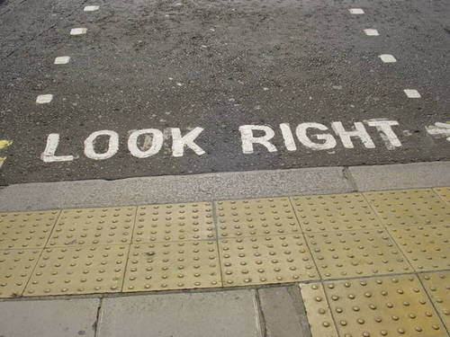

## Nudge

IN Richard Thaler's *Nudge*, he references the fact that we as humans  have an _automatic system_ and a _reflective system_ that guide our choices

- What _Nudge_ calls the automatic system, _Thinking Fast and Slow_ calls System 1
- What _Nudge_ calls thereflective system, _Thinking Fast and Slow_ calls System 2

There is no need to worry about the reflective system under this view

But the automatic system can make mistakes, especially when confronted with complexity and ambiguity.

The central argument of the book is that it is possible to modify the choice environment facing a human to ensure fewer mistakes by the automatic system in every one of us. 

These modifications are called **nudges**, and the people designing them in the language of the book are **choice architects**. 

The ideas get brought to life in the introductory example of the book. 

## The Caffeteria Example

>A friend of yours, Carolyn, is the director of food services for a large city school system. She is in charge of hundreds of schools, and hundreds of thousands of kids eat in her cafeterias every day. Carolyn has formal training in nutrition (a master’s degree from the state university), and she is a creative type who likes to think about things in nontraditional ways.

>One evening, over a good bottle of wine, she and her friend Adam, a statistically oriented management consultant who has worked with supermarket chains, hatched an interesting idea. Without changing any menus, they would run some experiments in her schools to determine whether the way the food is displayed and arranged might influence the choices kids make. Carolyn gave the directors of dozens of school cafeterias specific instructions on how to display the food choices. In some schools the desserts were placed first, in others last, in still others in a separate line. The location of various food items was varied from one school to another. In some schools the French fries, but in others the carrot sticks, were at eye level.

>From his experience in designing supermarket floor plans, Adam suspected that the results would be dramatic. He was right. Simply by rearranging the cafeteria, Carolyn was able to increase or decrease the consumption of many food items by as much as 25 percent. Carolyn learned a big lesson: school children, like adults, can be greatly influenced by small changes in the context. The influence can be exercised for better or for worse. For example, Carolyn knows that she can increase consumption of healthy foods and decrease consumption of unhealthy ones.

>With hundreds of schools to work with, and a team of graduate student volunteers recruited to collect and analyze the data, Carolyn believes that she now has considerable power to influence what kids eat. Carolyn is pondering what to do with her newfound power. Here are some suggestions she has received from her usually sincere but occasionally mischievous friends and coworkers:

### Design Options

1.  Arrange the food to make the students best off, all things considered.

2.  Choose the food order at random.

3.  Try to arrange the food to get the kids to pick the same foods they would choose on their own.

4.  Maximize the sales of the items from the suppliers that are willing to offer the largest bribes.

5.  Maximize profits, period.

## Choice Architecture

Carolyn is what we the book *Nudge* calls a choice architect. A choice architect has the responsibility for organizing the context in which people make decisions. 

Just like in real architecture, in choice architeccture there is no "neutral design". In real architecture, whatever architectural design is implemented, it will have implications for how the building is used and hence impacts the overall functionality of the building. Altering the details of the chocie environment so as to influence behavior is choice architecture. 


> And just as a building architect must eventually build some particular building, a choice architect like Carolyn must choose a particular arrangement of the food options at lunch, and by so doing she can influence what people eat. She can nudge.

>A nudge, as we will use the term, is any aspect of the choice architecture that alters people’s behavior in a predictable way without forbidding any options or significantly changing their economic incentives. To count as a mere nudge, the intervention must be easy and cheap to avoid. Nudges are not mandates. Putting the fruit at eye level counts as a nudge. Banning junk food does not.

The analogy with physical architecture helps us see market design as borrowing directly from product design. Just as humans use products, humans make decisions. Just as objects should be designed so humans intuitively use them correctly and successfully, so should choice contexts be designed so humans are readily able to make successful decisions. 

One of the pioneers of human centered design in realtion to objects is **Don Norman**, and  many of the principles he develops can be imported to choice architecture and market design

```{r}
vembedr::embed_youtube("rmM0kRf8Dbk")
```

### Good Choice Architecture

The book (and paper) offer **6 principles** of good choice architecture that are identified through the similarity and connection with product design. 

## Principle 1: Set Good Defaults


Every choice situation has a default choice, whether it is made explicit or not
    
- The default is what a chooser gets when she chooses nothing

- When people are required to choose one item from a list, it is often helpful if the choice architect specifies a default choice that would be a good choice for most people, especially those who need help in choosing

It is evident that many products and objects are designed with good default behavior:

- Computers that switch off when unattended\, auto headlights that turn off when the engine is off

- As most people will keep the factory\-set default value of the length of time an unattended computer waits before it switches off\, it is important that this default be chosen carefully to help most computer users\, especially the least savvy

- Software downloads often come with a choice between a “recommended” download and a “custom” download\.
     - It is a good idea to help non-expert downloaders by designing the recommended download so that it is a good choice for most non-experts. 

    - This recommended option should be pre-selected, not just offered

    - However, the custom option should be available for those confident enough to use it

A specific tendency of System 1 where choice architecture and nudging has been used with great effect is *Status Quo Bias*

Status quo bias ia a tendency of System 1 and provides a path through which choice architecture can improve decisions by appealing directly to System 1. 

The following video from a talk by Dan Ariely provides a  vivid example of choice architecture in action.

```{r}
vembedr::embed_youtube("9X68dm92HVI")
```

### Status Quo Bias in Policy 

A provision in the No Child Left Behind Act requires that school districts supply the names\, addresses\, and telephone numbers of students to recruiters in the armed forces

However\, the law also says that parents have the right to have their children’s information _not_ given to the recruiters

The Fairport\, NY school district interpreted the law as an ‘opt\-in’ policy: information is given to recruiters only for those students whose parents give explicit permission

The Defense Department on the other hand insisted that the law was an ‘opt\-out’ policy: information will have to be given to recruiters for all students _except_ the students whose parents explicitly refuse permission

<span style="color:#FF0000">Both sides understood the power of the default option</span>

### Default Choice or Mandated Choice?

Instead of specifying a default choice—a choice that will be applied to those who make no choice—the choice architect could force every individual to make a choice

* Forcing a choice is a good idea when it is important to get the chooser to think hard about the choice and come to a conclusion\, instead of relying on the default
* This is likely to be true especially when
  * there is no default that is likely to be the right choice for a large number of people\, and
  * many people will likely end up hating the default

* However\, mandated choice is not helpful when the choice requires expert knowledge\.
  * In such cases\, most people would be happier accepting the suggestion of an expert
* Moreover\, the choice may not be a simple yes or no choice\. It may require choices about innumerable little details\.
  * In such cases\, it may be easier to simply rely on the default


## Principle 2: Expect Error

A well\-designed product or system anticipates the errors that its users are likely to make and helps them avoid such errors

- Card readers that read data no matter how the card is inserted

- Cars that warn you if you are not wearing seat belts\, are running out of gas\, should have the engine checked\, etc\.

- Different nozzles for different fuels at a gas station, so that a car does not get the wrong fuel

- The hose and the delivery port should be unique to each important injected drug so that chances of confusion are minimized

- The use of placebo pills to regularize dosage for drug compliance

- Medical checklists for physicians to reduce infection rates (Atul Gawande's books)

- The “look right” signs at London crosswalks



## Principle 3: Give Feedback

Choice architects should warn users when they are probably making mistakes

- You are much likelier to take better pictures if you use cameras (digital or polaroid) that give instant feedback\, than if you use film cameras that require a lot of time and effort to develop film into photographs (was a relevant issue at the time of the book's writign!)

- Warnings signs and lights from computers and cars (although recognize the *boy who cried wolf* risk)

- Ceiling paint that is pink when wet and white when dry


## Principle 4: Mapping Choices to  Welfare

People make better choices when they have help in understanding what the various choices means in terms of their personal happiness

- Instead of telling customers the number of megapixels in a typical photo taken by a camera\, tell them what is the largest recommended print size

- For complex products, especially financial products such as credit cards\, insurance\, mortgage, etc,  one usually has to consider many features of the product and also to anticipate how one would utilize the product and its various features

Here is a type of libertarian paternalistic \(nudge\) called RECAP that Thaler discusses (the technological mechanism is outdated to some degree, but the idea remains useful) 

- Record\, Evaluate\, and Compare Alternative Prices \(RECAP\):
- Require the seller of any financial product to provide
    - a downloadable spreadsheet that shows all fees
- Require the seller of a financial product purchased by an individual to provide
    - a downloadable spreadsheet that shows how the consumer used the product in a typical period in the past

These documents would enable the consumer to generate\, in a spreadsheet\, an accurate measurement of the full costs that he/she actually paid for the product he/she is using …

… and simulations of what the costs would be under alternative patterns of use of the product or similar products

This would make it a lot easier to compare alternative complex products

## Principle 5: Structure Complex Choices

- When people need to choose one item from a long list and evaluate each item by another long list of criteria\, people use rules\-of\-thumb
    - For example\, an apartment hunter may restrict his choice to only those apartments with a commute less than 30 minutes
- Such strategies are imperfect; one may miss out on an outstanding apartment with a 32\-minute commute
- Naturally\, nudges are needed

- Consider how paint color options are presented at a paint store. 

- Online stores have vast collections\. But they also offer
    - sophisticated search capabilities by various categories\, and
    - users’ recommendations and comments
    - correlation\-based recommendations
    - Such structuring of choices make choosing easier

- Relationship to the *paradox of chocie*?

## Principle 6: Make Incentives Salient

- While human beings respond to nudges\, they also respond to _incentives_

- Make sure users have the right incentives

- Make the incentives _salient_ \(or prominent\) so that people don’t miss them
  * People tend to overweight the costs of a cab ride and underweight the full costs of having a car
  * A tax on energy use will have a bigger effect if the thermostat tells the user the savings from turning the temperature down by a degree

## NUDGES

i <span style="color:#FF0000">N</span> centives

<span style="color:#FF0000">U</span> nderstand how choices correspond to happiness

<span style="color:#FF0000">D</span> efaults

<span style="color:#FF0000">G</span> ive feedback

<span style="color:#FF0000">E</span> xpect error

<span style="color:#FF0000">S</span> tructure complex choices

