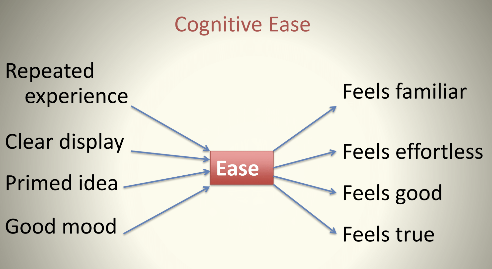
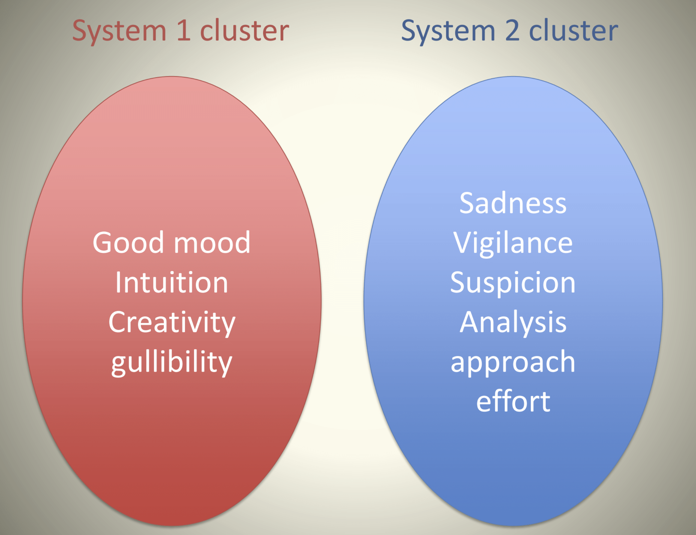
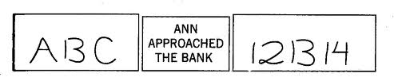

## The  "Associative Machine"

A major feature of System 1 is the ability/speed to function as an
"associative machine", e.g., form links between ideas/actions/events in
associative memory and develop causal and coherent accounts of these
linkages. 

Thus, for example if you see a dog, you expect to see his
master. Alternatively, if you hear a breaking sound, you expect to see
that something has been broken. 

Certain effortless instincts and
associations of System 1 are learned automatically from birth, e.g.,
detect hostility in a voice.

Other automatic activities of System 1 become learned through prolonged
practice that creates associations between ideas, e.g., the expertise of
a chess master in reading a board. 

From this network of associations
stored in memory, System 1 can create inference/understanding/accounts
of sensory data in the environment in automatic and instantaneous
fashion. 

As TFS describes:

>the knowledge is stored in memory and accessed without intention and without effort.

As an example of the associative phenomena, consider the following
example of two words on a page:

<center>
<font size = "4pt">
**Banana Vomit**
</font>
</center>
<br>

One of the first things System 1 experience upon reception of these
words is a mild element of surprise -- it is uncommon to see these words
juxtaposed in this fashion (perhaps having never seen together at this
point). 

Nevertheless, the associative machine will immediately work to
tie these two together using properties of associative memory. 

The most likely association it will create is a temporal sequence whereby the
banana *caused* the sickness inducing the vomit. This gravitation
towards *associative coherence* will take place automatically without
our conscious intervention or effort.

Moreover, once this association is now formed and placed (at least
temporarily) in memory, it will automatically activate a cascading
network of related associations that can affect our behavior- a
phenomena known as *priming*. 

- Experience unpleasant images and memories
- face twists slightly in disgust
- heart rate increases
- hair on arms rises a little
- sweat glands activated
- attentuated version of how you would react to actual event, beyond your control
- temporary aversion to bananas

In this case, we will feel a momentary
physical aversion to bananas, and we will be more attuned receptive to
concepts related to "vomit" and "bananas" -- sick, stink, nausea,
yellow, fruit, apple, berries.

The mechanisms of association of ideas should be seen as nodes in a
large network (associative memory) in which each idea is linked to many
others. 


The linkages can take have different underlying
meaning/interpretation such as

- Causes linked to effects (virus -> cold)

- Things linked to their properties (lime -> green)

- Things to the category in which they belong (banana -> fruit)

The association of ideas was understood by Enlightenment philosophers
*John Locke* and *David Hume* as a basis for human intelligence. 

The modern scientific appreciation to the subject adds to this philosophical
tradition by recognizing that each when a node in this network is
activated in memory, it triggers activation of the entire linked network
of ideas/concepts all at once in a manner that is automatic (System 1)
and hidden from our conscious selves. 

The activation mechanism is
symmetric - causes activate effects and effects activate causes.

### Hebbian Learning


>“When an axon of cell A is near enough to excite a cell B and repeatedly or
>persistently takes part in firing it, some growth process or
metabolic change takes place in one or both cells such that
A’s efficiency, as one of the cells firing B, is increased.”
>
> --- D. O. Hebb (1949)


Or said another way....


<center>
**"Neurons that fire together, wire together. Neurons that fire out of sync, fail to link."**
</center>


- **Dendrites** : Act as the channel that gets signals to cell body with their strength as weights
 
- **Cell Body** : Collects input through dendrites and processes to produce output

- **Axon** : Responsible for transmitting signals to other neurons

A biological neural network consists of a collection of neurons and their synaptic connections. 


- At a point in time the network is characterized by a state - a pattern of activity (*on/off*) of the individual neurons.

- Neurons update their activity based on the input the receive over the synapses. Information is processed by the network through activity spread.

### Synaptic Strength


- Synapses are the links between neurons or between neurons and fibers carrying external input. 

- A synapse carries pre-synaptic activity to the post-synaptic site. 

- Synapses have differential strength, reflecting the amount of energy it transmits to the post-synaptic neuron from activity at the pre-synaptic site. 


### Priming

The functioning of this associative machinery leads to a certain
"manipulability" of System 1 through associative cues known as priming.

Priming arises when exposure to one idea makes an individual more
receptive to the suggestion of another idea due to familiarity induced
by change in the state of memory from the network of underlying
associations. 

A mundane illustration of priming is when exposed to "eat"
it makes it more likely someone fills in the blank of 

<center>
<font color = "red" size = "6pt">
SO_P
</font>
</center>
<br>

with <font color = "red"> SOUP </font> rather than <font color = "red"> SOAP </font> (and vice versa if exposed to "wash" rather than "eat"). 

However, there are some more non-trivial manifestations of priming that Chapter 4 documents.

### The Florida Effect

Among the most famous of these is the "Florida effect". 

John Bargh at NYU conducted a study with students (aged 18 -- 22) who were asked to assemble 4-word sentences from 5 words Eg: "finds he it yellow instantly". The treatment group was asked to unscramble sentences that
included words such as

<br>
<center>
**Florida, forgetful, bald, grey, wrinkle**
</center>
<br>

The students were then asked to walk down the hall to complete another
task, but it turned ou this walking trip was the heart of the
experiment. 

**The key finding is that the treatment group walked down
significantly slower than others!**

The "Florida effect" involves two stages of priming. First the words
exposed to the treatment effects primes ideas of old age (observe the
word "old" is never mentioned). Second, old age primes a behavior,
namely walking slowly. 

The "Bargh lab" has produced some other notable priming effects. Consider the example in the video. 

```{r}
vembedr::embed_youtube("vI0fFEffDd8")
```


An important dimension of the hypothesized effect
is that the priming mechanism also works through the reciprocal links of
the associative machine. 

A study conducted at a German university showed
the Florida effect in reverse. Students were asked to walk around a room
for 5 minutes at 1/3 of the normal pace (30 steps per second).
Afterwards they were much quicker to recognize words associated with old
age. 

Likewise, in another study, tests were done while subjects are
smiling/frowning (induced by a pencil held in the mouth) or
nodding/shaking head. Depending on the treatment, these groups differed
in finding cartoons funnier, upsetting pics worse, and radio editorials
more or less agreeable.

Priming effects play a major role in how firms attempt to **market
products** to consumers. More recently, priming effects have launched
theories and practices as to how to induce specific influences and
behaviors in others through 

```{r}
vembedr::embed_youtube("HctZg2aOPMw")
```


### Endorsing Intuitions: Cognitive Ease 

When System 1 can readily achieve cognitive coherence, it provides a
sensation of cognitive ease. It is lack of cognitive ease (or cognitive
strain) that is one of the warning signs that mobilizes System 2.
However, when cognitive ease is present, the endorsements of System 1
are more readily accepted by System 2.

The feeling of cognitive ease is embedded in its own associative network
of ideas internalized by System 1, and described on P.60.




When an idea/concept/communication has been repeated in the past, is
displayed/communicated clearly, has been primed in advance, and conveyed
when the subject is in a good mood, these all enhance the chances for
the experience of cognitive ease. 

Likewise when the subject experiences
cognitive ease associated with a stimuli, the subject is more likely to
experience affects like the feeling of truth, feeling of familiarities,
and feeling good/effortless.

This diagram has a variety of behavioral implications. It suggests that
when cognitive ease is achieved, then statements are more likely to be
believed. 

Given that mood, familiarity, clarity, priming affect
cognitive ease, then one implication is that if you want your message to
be believed by a person, you should use repetition, simple and clear
language, have positive/likeable demeanor to affect mood, and prime
(think "pre-suasion") for your message.

This also implies the opposite result -- when pre-conditions for
cognitive ease are not realized (and cognitive strain is experienced)
then System 2 is more likely to scrutinize the plausibility of
conclusions. Consider the questions designed by Shane Frederick's
"Cognitive Reflection Test"

<center>
<font color = "blue">
A bat and a ball cost $1.10
<br>
The bat costs one dollar more than the ball
<br>
How much does the bat cost?
</font>
<br>
<br>
**Or**
<br>
<br>
<font color = "blue">
All roses are flowers
<br>
Some flowers fade quickly
<br>
Therefore some roses fade quickly
</font>
</center>
<br>
<br>

In each case, the intuitive answer (1 dollar and yes) is the wrong
answer that you can check with half a minute of deliberative thought. In
fact, More than 50% of Harvard, MIT and Princeton students give the
wrong answer -- at other universities this is as high as 80%.

However as Kahneman argues

>Does this mean we are subject to inferior thinking due to our generally
lazy System 2 behavior which is only incited due to a signal of strain
from System 1. To the contrary, the ability of System 1 to sift through
ideas in search of patterns of association that create cognitive ease is
one of the drivers of creativity. See the findings on good feeling and
the Remote Association Test on pages 68-69.

This suggests two distinct clusters of cognitive experiences.




## A Machine for Jumping to Conclusions

System 1 is engaged in a constant state of monitoring and assessment.

This serves a crucial evolutionary function: humans are confronted with a variety of circumstances in which survival depends on quick/sensible decisions getting made.

A vestige of this evolutionary past is a strong tendency by System 1 to jump to conclusions based on associative coherence, and suppress ambiguity.

>Jumping to conclusions is efficient if the conclusions are likely to be correct and the costs of an occasional mistake acceptable\, and if the jump saves much time and effort




In each case we are unconscious to the inherent ambiguity

### Halo Effect

The System 1 suppression of ambiguity leads to the “Halo Effect”

If you like one thing about a person you have  tendency to like everything and vice versa.

**What do you think of Alan & Ben?**
<center>
**Alan**:  intelligent\, industrious\, impulsive\, critical\, stubborn\, envious\.
<br>
**Ben**: envious\, stubborn\, critical\, impulsive\, industrious\, intelligent\.
</center>
<br>

As Kahneman explains:

>The sequence in which we observe characteristics of a person is often determined by chance\. Sequence matters\, however\, because the halo effect increases the weight of first impressions\, sometimes to the point that subsequent information is mostly wasted” \(TFS\, p\. 83\)

Implications for polarization of attitudes and beleifs among different groups?

### What you see is all there is (WYSIATI)

<span style="color:#C0504D">“An essential design feature of the associative machine is that it represents only activated ideas\. Information that is not retrieved *even unconsciously* from memory might as well not exist"</span>

<span style="color:#C0504D">System 1</span> constructs the best possible story incorporating the ideas that have been activated but does not cannot allow for info it doesn’t have\.

“Will Mindik be a good leader? She is intelligent and strong…”

System 1 has a coherent association and an answer…**yes!**

Importantly, what did System 1 _not_ do: 

<center>
“What would I need to know before I formed an opinion about the quality of someone’s leadership”?
</center>

<font color = "red"> So what is the problem? </font>

Isn’t System 1 *warts and all* making life functional?

>System 1 bets on an answer\, and the bets are guided by experience\. The rules of the betting are intelligent…WYSIATI facilitates the achievement of coherence and of the cognitive ease that causes us to accept a statement as true\. It explains why we can think fast\, and how we are able to make sense of partial information in a complex world\. Much of the time\, the coherent story we put together is close enough to reality to support reasonable action\.


