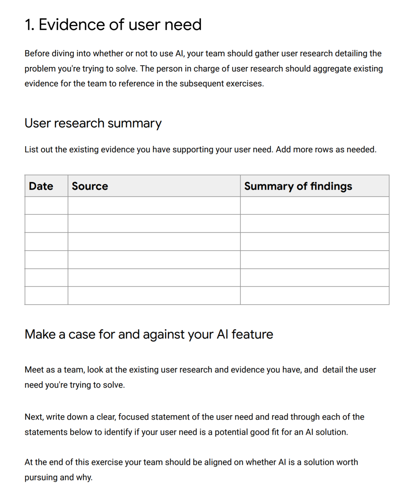
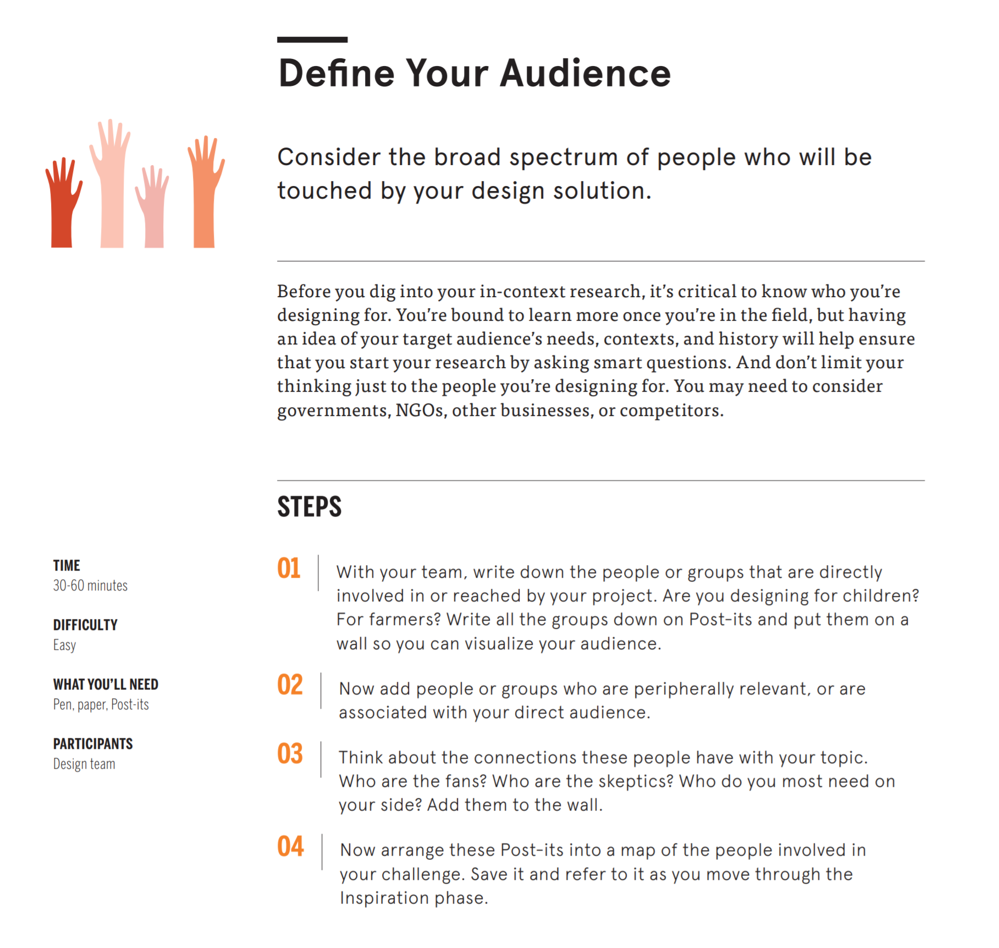
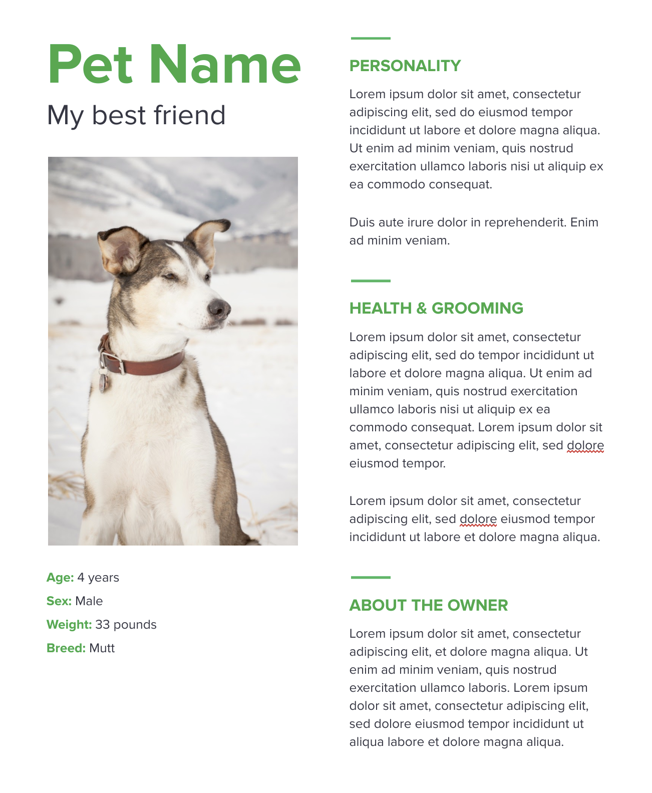

Now that you have a problem you are trying to impact and a first iteration design question, lets start to **converge** on a specific scenario where your efforts will be impactful. 

The ultimate goal will be to collect evidence for the hypothesized elements in your design thinking. Evidence will take a structured form. Here is an example used by AI teams at Google. 

You will collect this information by talking to people - e.g., **User Interviews.**

But who should you ask?

This amounts to understanding your audience better, which in turns gives you a deeper appreciation for your problem and design question. 

## Class Activity

## User Persona

Use the **define your audience** exercise to build 3 User Personas - e.g., personality profiles of your potential users. Your goal is to find users and interview them and have one user from each prototype. 

There are many online tools available to help you develop flashy user personas. Feel free to adopt any such took to guide your thinking. 

However for the purpose of our second milestone, we will use the simple medium of google docs. Adopt the **Pet Resume** template in Google docs and build 3 User Personas. 

Part of the goal of defining the user (and ultimately improving their lives in some fashion) is to narrow their pain points so you know what to rapidly prototype. Consider the advice from a human-centered designer:

>I like to use the problem youth sports sign-ups in my courses and workshops. Being a mom of four kids, I really struggle to sign them up for sports in a hassle-free, efficient way. Something always seems to go wrong. When designing for a persona whose frustration is dealing with complicated scheduling, the wireframe should reflect a solution to frustration by displaying the time and date of the practices and games prominently. They shouldn’t just be another line of text. They should be a heading or in their own column. It’s important to have them stand out so that the user will have their frustration alleviated or at least reduced due to clear communication on the scheduling of the sports events. This is just one way to accommodate this frustration, but it’s straightforward giving us a clear sense of how a person directly ties into a wireframe.

Here are the dimensions to reflect in your profiles:

- Name
- Demographic data
- Picture
- Background
- Behaviors/Hobbies/where they spend time making decisions
- Problem/Pain/Frustrations
- Urgency/Intensity
- Answer to the question: What is most important is to connect the emotions of your persona with the problem being addressed?
