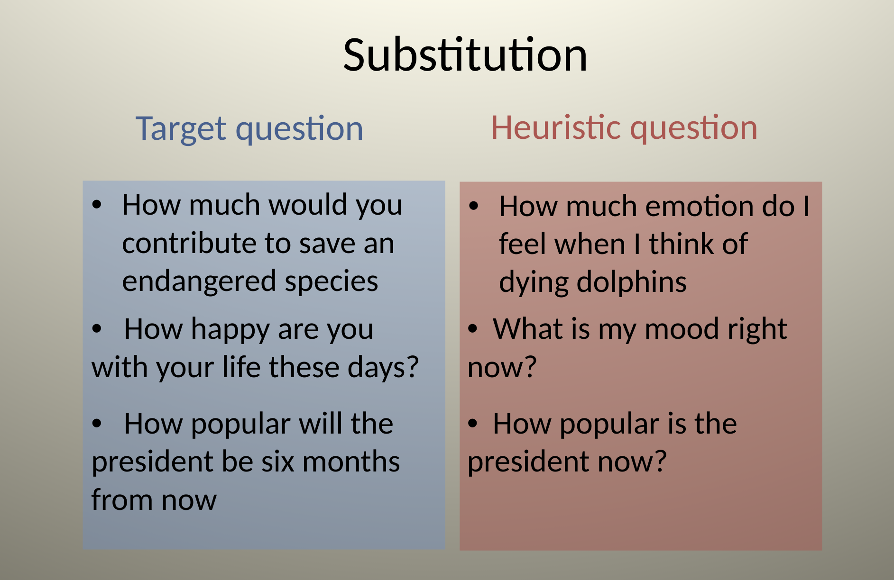
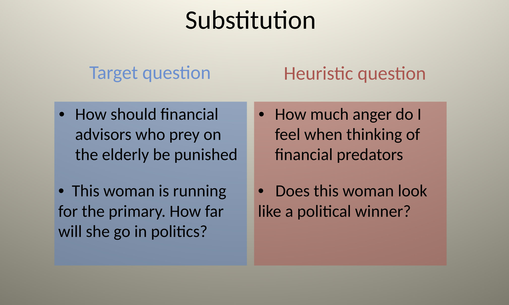
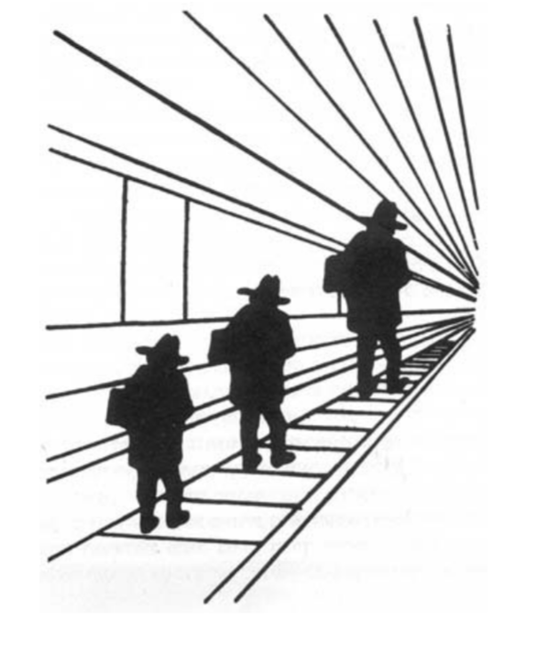
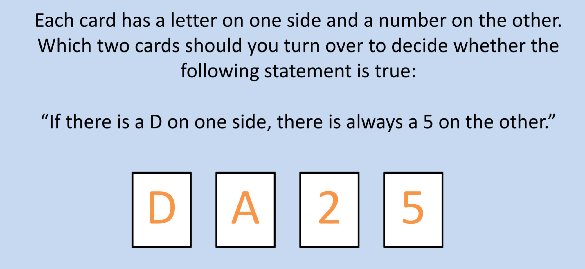
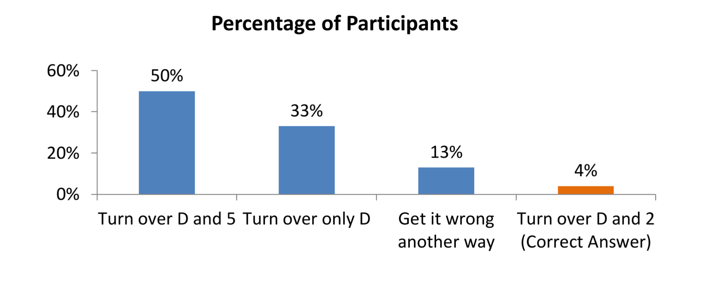
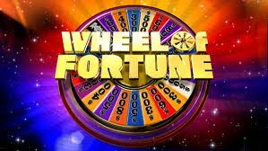

##  A Machine for Jumping to Conclusions 

- System 1 is engaged in a constant state of monitoring and assessment.

- This serves a crucial evolutionary function: humans are confronted with a variety of circumstances in which survival depends on quick/sensible decisions getting made.

- A vestige of this evolutionary past is a strong tendency by System 1 to jump to conclusions based on associative coherence, and suppress ambiguity.

> Jumping to conclusions is efficient if the conclusions are likely to be correct and the costs of an occasional mistake acceptable, and if the jump saves much time and effort

**In each case we are unconscious to the inherent ambiguity**.

##  System 1 suppression of ambiguity leads to the “Halo Effect” 

If you like one thing about a person you have  tendency to like everything (and vice versa)

###  What do you think of Alan & Ben? 

 Alan :  *intelligent, industrious, impulsive, critical, stubborn, envious*.  
 Ben : *envious, stubborn, critical, impulsive, industrious, intelligent.*

  

>The sequence in which we observe characteristics of a person is often determined by chance. Sequence matters, however, because the halo effect increases the weight of first impressions, sometimes to the point that subsequent information is mostly wasted” 
---TFS, p. 83

## What you see is all there is (WYSIATI) 

> An essential design feature of the associative machine is that it represents only activated ideas. Information that is not retrieved (even unconsciously) from memory might as well not exist"

System 1 constructs the best possible story incorporating the ideas that have been activated but does not (cannot) allow for info it doesn’t have.

::: {.fancy .large}
So what is the problem?
Isn’t System 1 (warts and all) is making life functional?
:::

 

>System 1 bets on an answer, and the bets are guided by experience. The rules of the betting are intelligent…WYSIATI facilitates the achievement of coherence and of the cognitive ease that causes us to accept a statement as true. It explains why we can think fast, and how we are able to make sense of partial information in a complex world. Much of the time, the coherent story we put together is close enough to reality to support reasonable action.

##  The Mental Shotgun 

Where things go wrong for our intuitive system is when the **mental shotgun** takes place.

]

 

::: {.fancy .large}

What is the “mental shotgun”?

:::

**Directing the mind to a problem is unleashing a mental shotgun: a spray of bullets rather than a targeted hit.**

How does it work?

`r fontawesome::fa("arrow-down")`

Intention to perform one computation (targeted to System 2) evokes another (hijacked by System 1)

`r fontawesome::fa("arrow-down")`

System 1 is faster and so it suggests a solution quickly, and System 2 is lazy.

###  Example

> Participants in one experiment listened to pairs of words, with the instruction to press a key as quickly as possible whenever they detected that the words rhymed. The words rhyme in both these pairs:

**VOTE—NOTE**

**VOTE—GOAT**
 

The key to what makes this experiment illuminating are the instructions - to press a key when the words are detected to **rhyme**. 

What actually happened in the experiment? Why?

##  Substituting Questions 

>I propose a simple account of how we generate intuitive opinions on complex matters. If a satisfactory answer to a hard question is not found quickly, System 1 will find a related question that is easier and will answer it. I call the operation of answering one question in place of another substitution …  The idea of substitution came up early in my work with Amos, and it was the core of what became the heuristics and biases approach.

Substitution can be an effective way to solve problems. It is an example of a **heuristic**

> The technical definition of a heuristic is a simple procedure that helps find adequate, though often imperfect, answers to difficult questions. The word comes from the same root as eureka

Substitution was discussed in the George Polya classic book on mathematical reasoning *How to solve it, where he famously wrote "**If you can’t solve a problem, then there is an easier problem you can solve: find it.**"

As Kahneman writes: 

>Pólya’s heuristics are strategic procedures that are deliberately implemented by System 2. But the heuristics that I discuss in this chapter are not chosen; they are a consequence of the mental shotgun, the imprecise control we have over targeting our responses to questions. 

Thus heuristic is a reasoning strategy that is used to solve a problem , make a decision or form a judgment about something.
Original meaning: A heuristic is a strategy that leads to insight, discovery and learning.

**Example**:  To decide whether Option A is better than Option B.  

E.g.,   Decide whether to buy a new smart phone with special features.

**Heuristic #1**:	Assume that various specific situations prevail – Is A better than B in these situations ?

**Heuristic #2**:	Ask people who chose A how they feel about their choice?  Do the same for Option B.

##  Attribute Substitution 

Person wants to evaluate a case with respect to a target attribute.

  Example  You are interviewing job applicants. 

- **Target Attribute**: How they will perform on the job over the long run?

The target attribute is hard to evaluate directly but information about a related heuristic attribute  comes readily to mind.

- **Heuristic attribute** : success of job interview.

- **Attribute Substitution**:  Judgment of target attribute is based on the heuristic attribute.

 Example  :  Professor hears the talk of a job candidate.

- **Target attribute**:  How successful will this candidate be in the long run?

- **Heuristic attribute**:  How impressive was the talk?

How do these two questions differ?  

Observe that the heuristic attribute is not logically equivalent to the target attribute – it isn’t even highly correlated with it, but it is a salient piece of information that is available to system 1. 

The Todorov example of impressions of faces of politician's and electoral outcomes? How was substitution at play there?

Consider a few more examples.

## Intensity Matching
> Something is still missing from the story: the answers need to be fitted to the original question.

##    When is Attribute Substitution Likely to Occur?  

Attribute substitution is more likely when:

1. the target attribute is relatively inaccessible, i.e., hard to evaluate or unfamiliar;

2. a semantically and associatively related attribute is highly accessible (heuristic attribute);

3. the substitution of the heuristic attribute in the judgment is not rejected by critical operations of System 2.

 

##  The Anatomy of Bias 

+ Imagine a target question that is intended to engage System 2

	+ Through the mental shotgun System 1 is engaged.

	+ System 1 seeks associative coherence and cognitive ease

	+ It will solve a substitute question instead – something the associative machine is capable of solving.

	+ Reasoning about the substitute questions differs in systematic ways from reasoning about the target

	+ The suggestions which are fed to System 2 become hard to overturn/disbelieve – System 2 is lazy

	+ They create cognitive illusions – what does it take to disbelieve a visual illusion?

## The 3-D Heuristic

Consider the image

Consider the question: As printed on the page, is the figure on the right larger than the figure on the left. 

What is the substitution that takes place?

>The essential step in the heuristic—the substitution of three-dimensional for two-dimensional size—occurred automatically. The picture contains cues that suggest a 3-D interpretation. These cues are irrelevant to the task at hand—the judgment of size of the figure on the page—and you should have ignored them, but you could not. The bias associated with the heuristic is that objects that appear to be more distant also appear to be larger on the page. As this example illustrates, a judgment that is based on substitution will inevitably be biased in predictable ways. In this case, it happens so deep in the perceptual system that you simply cannot help it.

## The Mood Heuristic

Consider the questions

**How happy are you these days?**
**How many dates have you had in the last month?**

Key finding - zero correlation. Apparently dating did not systematically come to mind in consideration of overall happiness. 

However consider the flip

**How many dates have you had in the last month?**
**How happy are you these days?**

What happened? Why?

The key idea is that "Happiness these days" is not an easy or natural assessment - the mental shotgun kicks into action. 

###  The role of “unbelieving” is left to System 2 

+ We are rarely stumped
	+ Have intuitive feelings & opinions about everything
	+ Like or dislike on sight
	+ Trust or distrust on sight
	+ The ability to question/doubt/probe/debunk is tied to System 2.
	+ Gilbert “Bias to Believe” experiments (pages 80-81)

Lazy or Busy/Depleted System 2 endorses our intuitive beliefs

###  System 2 acts as biased lawyer 

+ Even when it tries to probe, it is still hamstrung.

+ Searches for information consistent with existing beliefs

+ Acts as apologist not critic

	+ Fights in the court of public opinion to persuade others of system 1 ’s view

### Confirmation Bias

##  Anchoring Heuristic 

Is the average yearly rainfall in Miami ( Florida) greater or less than ….

Now write down your best guess as to the average yearly rainfall in Miami .

- **Condition 1**:  2 inches/year
- **Condition 2**:   750 inches/year

What do you think is the typical finding? Why is this associated to the anchoring heuristic?

FYI : Average yearly rainfall in Miami is 61.9 inches per year (157.2 cm/year).  Average yearly rainfall in Seattle is 37.7 inches (95.8 cm).

What is the **anchor and adjust** heuristic:

- Step 1:  Consider an initial estimate of the quantity you are trying to judge.  This is the “anchor.”  (People often know that this initial estimate isn't perfectly accurate.)

- Step 2:  Adjust the initial estimate in the direction that corrects for assumed sources of error.

**Psychological Fact**:  Adjustments are typically too small!

**Result** :  Final judgment is overly influenced by the anchor, i.e., the final estimate is biased towards the anchor.

While this might seem like a reasonable estimation strategy, it has perverse effects that are evocative of a System 1 bias. Consider the wheel of fortune example from TFS. 

Built to stop at 10 & 65 (randomized between groups). Write down the number that the wheel stops. 

Now answer the question:

+ Is the percentage of African nations among the UN members larger or smaller than the number you just wrote?
+ What is your best guess of the percentage of African nations in the UN?

Those who wrote down (10) guessed on average 25%, and those who wrote down 65 guessed on average 45%.

Consider another example

Annual donation “to save 50000 offshore Pacific Coast seabirds from small offshore oil spills until ways are found or prevent spills or require tanker owners to pay for the operation.”

- No anchor ($65)
- Would you be willing to donate 5 dollars? (20 dollars)
- Would you be willing to donate 400 dollars? (143 dollars)

##  Why Are Estimates Biased Towards the Anchor? 

+ Adjustments stop when you reach the range of values which seem to be possible answers.

	+ E.g., I think that the rainfall in Miami must be between 20 - 80 inches per year.  If the anchor = 2 inches, I adjust until my estimate is over 20. If the anchor is 600 inches, I adjust until my estimate is under 80.
	
	+ Cognitive Laziness:  I am too quick to terminate the process  of finding the "best" estimate.
	
	+ Priming:  The anchor primes similar thoughts which influence the production of the estimate.
	

Think about scenarios in life where anchoring applies (e.g.,any bargaining situation)

###  Assume any number has an anchoring effect and mobilize system 2 to combat it. 

Example:  Suppose a biased or unreliable news source tells you that something extreme will happen, e.g , next year 50% of retail banks will fail.

You don’t trust this news source, so you adjust the estimate from 50% to something you think is more realistic, but your adjustment will typically be too small.

Example:  Bargaining with seller.

Suppose you want to buy a useful but ordinary rug. Under usual circumstances, you would be willing to pay $100 for the rug. Suppose the seller says that he will sell the rug for $500. What is your counter offer?

### False Consensus Efect  

+ Example:  Suppose you are asked whether many people believe X or many people feel X.

E.g., What proportion of Americans favor repeal of Obama care (Affordable Care Act)?

+ Hypothesis:  People often anchor on their own opinions and values and then adjust to take into account other people’s differences.
Consequence:  We tend to expect others to be more like ourselves than they are.

