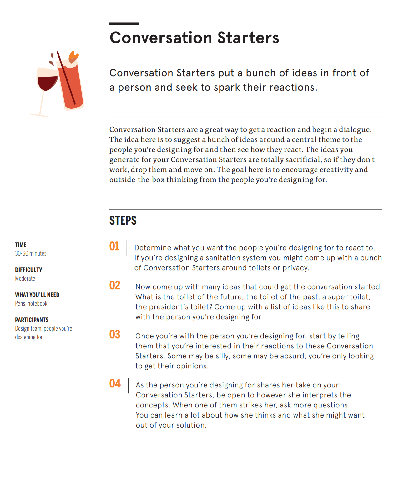
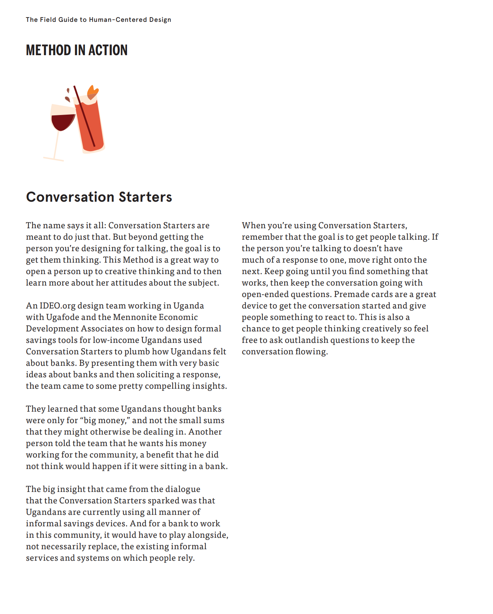
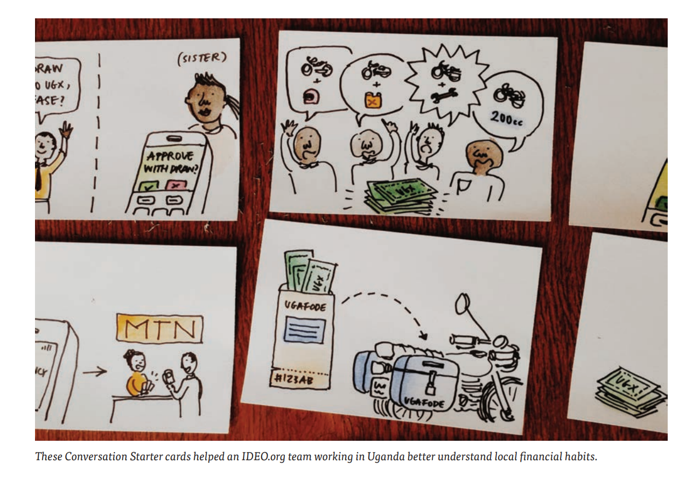

In order to collect data from the user and conduct primary research, you need a research strategy. 

The goal is to get the user to react, not to your analysis, but rather issues/concepts you want to understand directly from them. 

A data collection strategy is that of **conversation starters**

