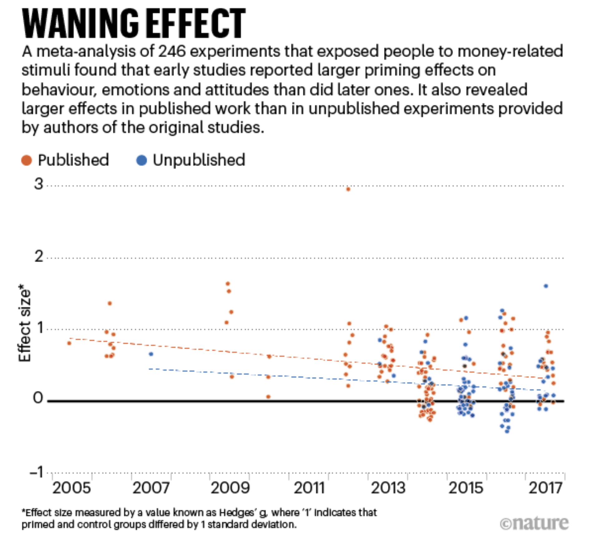
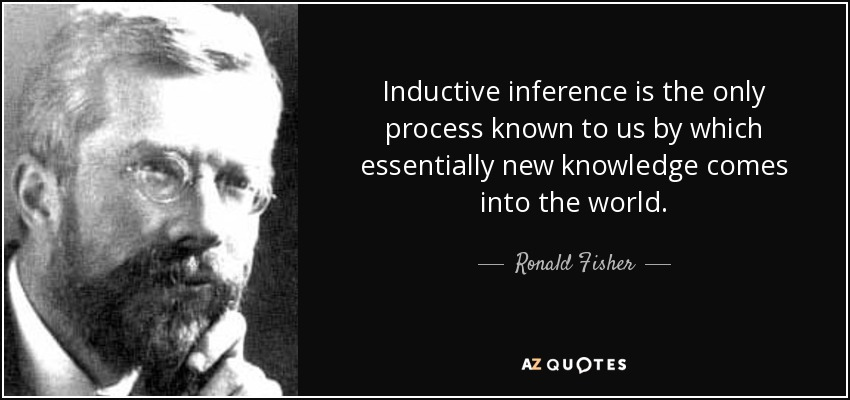
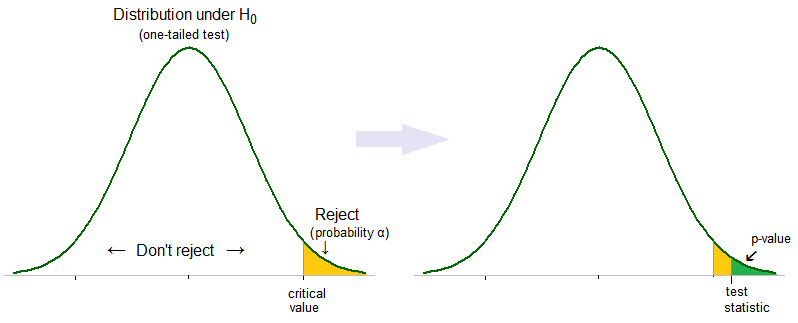

```{r}
knitr::opts_chunk$set(echo = TRUE)
```


###  Lets Answer a Simpler Question First… 

+ Consider an experiment where we take single draw from an urn with probability of red.

	+ Denote the outcome $Y$ of the experiment as that takes value of 1 if we draw a red, and 0 otherwise. 
	
+ $Y$ is a RV known as a Bernoulli Trial with probability mass function $P(Y = y)$ described as $$P(Y = y) = \begin{cases} p  &\mbox{for } y = 1 \\ (1-p) & \mbox{for } y = 0 \end{cases}$$


###  Repeated experiment 

+ Consider repeating the Bernoulli experiment $N$ times for $N$ large.
	+ Then the fraction of times in repetitions that the outcome of the experiment is red is approximately $p$.
	+ This is the law of large numbers
	+ Red is the outcome $o = \frac{p}{1-p}$ more times than white.
	+ $o$ is the ”odds” ratio of the Bernoulli trial.


###  Binomial experiment 

+ What if the number of Bernoulli trials is not a large $n$.
	+ Then the total number of red will exhibit *sampling* variability .
	+ Let $X_n$ be the total number of red draws after $n$ Bernoulli trials.
	+ Then .
+ $X_n$ is a binomial experiment with probability mass function $$P(X_n = x) = Bin(n,p)$$


We can calculate the mass function in R using `dbinom(x, n, p)`:

```{r}
dbinom(2, 10, .3)
```

###  Repeated Binomial Experiments 

+ Suppose we repeat the Binomial experiment many times
	+ Then the fraction of times the Binomial experiment returns $X_{n}=x$ is equal to the probability mass $P(X_{n} = x)$
+ The number of more times the Binomial experiment returns compared to is given by
 
We can draw from a binomial random variable $m$ times with `rbinom(m, n, p)`. Lets test the hypohtesis that for large $m$, these should be approximately equal. 

```{r}
library(tidyverse)
sim <- tibble(x = rbinom(10000, 10, .3))
sim %>%
  mutate(x_2 = x==2) %>%
  summarize(mean(x_2))
```

We can plot the PMF

```{r}
data.frame(red = 0:10, prob = dbinom(x = 0:10, size = 10, prob = 0.3)) %>%
  mutate(Red = ifelse(red == 2, "2", "other")) %>%
ggplot(aes(x = factor(red), y = prob, fill = Red)) +
  geom_col() +
  geom_text(
    aes(label = round(prob,2), y = prob + 0.01),
    position = position_dodge(0.9),
    size = 3,
    vjust = 0
  ) +
  labs(title = "Probability of X = 2 successes.",
       subtitle = "Bin(10, .3)",
       x = "Successes (x)",
       y = "probability") 
```

Lets compare to the sampling frequencies:

```{r}
tibble(red = 0:10, freq = map_dbl(0:10, ~mean(sim == .x))) %>%
mutate(Red = ifelse(red == 2, "2", "other")) %>%
ggplot(aes(x = factor(red), y = freq, fill = Red)) +
  geom_col() +
  geom_text(
    aes(label = round(freq,2), y = freq + 0.01),
    position = position_dodge(0.9),
    size = 3,
    vjust = 0
  ) +
  labs(title = "Frequency of X = 2 successes.",
       subtitle = "From 10,000 Repitions of Bin(10,.3)",
       x = "Successes (x)",
       y = "probability")   

```


###  Lets return to the question 

Imagine a large urn filled with marbles, half are red and half are white. Consider an experiment where we draw four balls, and record the number of red balls. 

Then we repeat the experiment many times. How much more often would we observe the expected outcome of “2 red and 2 blue”  in comparison to the extreme outcome “4 red”?

```{r}
dbinom(2, 4, .5)/dbinom(4, 4, .5)
```
As Kahneman writes

>Even with a stats education (and professors of economics and statistics) it takes some mental effort to see the equivalence of the two: ...Large samples are more precise than small samples.... Small samples yield extreme results more often than large samples do.... The first statement has a clear ring of truth, but until the second version makes intuitive sense, you have not truly understood the first. 


###  Changing the sample size 

+ Consider Jack who runs a repeated Binomial experiment with $n = 4$ draws and Jill who runs the repeated Binomial experiment with $n = 7$ draws.

+ How much more often does Jill see the “extreme” outcome of all red compared to Jack?

```{r}
dbinom(4, 4, .5) / dbinom(7, 7, .5) 
```


###  Now solve the mystery 

What does this reveal is the real “cause” of the conflicting new stories on kidney cancer?

As Kaheneman writes

> Now imagine the population of the United States as marbles in a giant urn. Some are marked KC for kidney cancer. You draw samples of marbles and populate each county in turn. Rural samples are smaller than other samples. Just as in the game of Jack and Jill, extreme outcomes (very high and/or very low cancer rates) are most likely to be found in sparsely populated counties. That is all there is to the story


###  The law of small numbers 

+ The key factor is not Republican or rural it is sparsely populated.
	+ Small samples are more likely to yield extreme outcomes – this is a purely statistical phenomena.
	+ Yet people treat small samples as representative of the larger sample from which they come (later to be called the “representative heuristic”), and overinterpret the data.


###  Random Sequences 

Consider the following sequence of boy and girl births at a hospital. What is their relative likelihood (most likely, etc )

<center>
BBBGGG <br>
GGGGGG <br>
BGBBGB <br>
</center>
<br>
What does System 1 want to say?

###  Causes Trump Statistics 

+ System 1 is not prone to doubt, suppresses ambiguity, and automatically constructs stories that are coherent. (what alternatives could have happened is the essence of statistical thinking but violates WYSATI)

+ The WYSATI produces exaggerated faith in small samples that exaggerates consistency and coherency of the world relative to the actual reliability of the data.


###  But what about the law of large numbers? 

+ System 2 knows the ”law of large numbers”.

+ But does not know it well enough to counteract the swift confidence of System 1.
	
+ Reprogramming a cognitive illusion can defy even experts


> I’ve been studying intuition for 45 years, and I’m no better than when I started. I make extreme predictions. I’m over-confident. I fall for every one of the biases.” 

###  Even the best of us can’t resist the lure of cognitive ease over plain old statistics 

Its just hard to see unless you have immense practice (even among practitioners!)


###  Scientific Crisis in Social Priming Studies 


### Priming

+ Florida Effect
+ Voting
+ Subtle reminders about money…..
+ Holding warm coffee…..
+ Listening to the Beatles “When I’m 64”


###  Disbelief is not an option 

TFS worded the research fairly strongly: 

> Disbelief is not an option …The results are not made up, nor are they statistical flukes. You have no choice but to accept that the major conclusions of these studies are true. More important, you must accept that they are true about you .” (TFS, p. 57)


[Disbelief is not an option](http://isites.harvard.edu/fs/docs/icb.topic1092050.files/Kahneman_Daniel._Thinking_Fast_and_Slow_pp._50-58.pdf)


###  The replication crisis 

“I don’t know a replicable finding. Its not that there isn’t one, but I can’t name it”

“I’ve gone from being full believer to full skeptic”

"when he read the relevant part of Kahneman’s book, “I was like, not one of these studies will replicate. And so far, nothing has”




###  The Irony Effect 

+ Kahneman and Tversky anticipated the problem in their first paper in 1971 **“BELIEF IN THE LAW OF SMALL NUMBERS”**

> Apparently, most psychologists have an exaggerated belief in the likelihood of successfully replicating an obtained finding. The sources of such beliefs, and their consequences for the conduct of scientific inquiry, are what this paper is about. Our thesis is that people have strong intuitions about random sampling; that these intuitions are wrong in fundamental respects; that these intuitions are shared by naive subjects and by trained scientists; and that they are applied with unfortunate consequences in the course of scientific inquiry.


###  Belief in the Law of Small Numbers 

> The strong bias towards believing that small samples closely resemble the population from which they are drawn is also part of a larger story: The exaggerated faith of researchers in what can be learned from a few observations is closely related to the halo effect, the sense we often get that we know and understand a person about whom we actually know very little. System 1 runs ahead of the facts in constructing a rich image on the basis of scraps of evidence. A machine for jumping to conclusions will act as if it believed in the law of small numbers. (TFS p 114)


###  A Confession 

See the blog Replicability-index
[Replicability-index](https://replicationindex.com/2017/02/02/reconstruction-of-a-train-wreck-how-priming-research-went-of-the-rails/comment-page-1/#comments)


###  What is happening 

+ People find something in the data
	+ It accords with what they believe should be true (confirmation bias)
	+ It gels with a causal account for explaining the phenomena
	+ The role that chance is playing in explaining their finding is ignored (System 1 beats a busy System 2)


###  Lets go deeper

+ Lets say we run a randomized study on the difference between a control group and treatment group on an outcome variable.

+ We find the treatment group has a slightly different outcome than the control group (e.g., hot vs cold drinks)

What can we conclude?


### Ronald Fisher




###  The p-value 

+ What is the likelihood of observing an observed effect size as large as under the null hypothesis that the two groups are statistically the same

+ This is , the so called p-value .
	+ Gives a basis for rejecting - a low p-value is a low concordance between the hypothesis and the evidence/data.

+ Type 1 error $\alpha$: We want to minimize the risk of a false positive– rejecting when it is true.

	+ We pick a small significance level (typically $\alpha = .05$) of the type 1 risk we are willing to incur.





+ Then the significance is typically set $\alpha = .05$

+ If then reject (equivalently, p-value smaller than .05)


###  The P-value: What the heck is it anyway? 

The American Statistical Association (ASA) warns about improper use and interpretation of the p-value on March 8th, 2016 ( 6 ); its Statement consists of 6 principles:

+ P-value can indicate how incompatible the data are with a specified statistical model.
+ P-value neither measures the probability that the studied hypothesis is true nor the probability that the data were produced by random chance alone.
+ Scientific conclusions and business or policy decisions should not be based only on whether a p-value passes a specific threshold.
+ Proper inference requires full reporting and transparency.
+ A p-value, or statistical significance, does not measure the size of an effect or the importance of a result.
+ By itself, a p-value does not provide a good measure of evidence regarding a model or hypothesis.”


###  What did we learn exactly? 

Lets say we fail to reject the null. Have we learned anything? Lets say we reject the nul. Have we learned anything?

###  What would Friedman say? 


We want to test a theory. Was the null hypohtesis our theory?

###  Jerzy Neyman

Jerzy Neyman and Egon Pearson’s theory of statistical tests extend Fisher’s significance testing framework


###  The idea 

+ To interpret a rejection of the null, it somehow has to matter what was a meaningful **alternative** to the null your theory had in mind.

+ The alternative is your theory of interest.

+ It matters whether the true effect of the theory is .01, or 50
	
+ Let the alternative be the smallest value such that there is a substantively interesting difference between the populations

###  Power vs Significance 

+ A Type II error is failing to reject the null when the alternative is true.

+ The risk of type II error is $\beta$

+ The power of the test $1-\beta$ is the probability of rejecting the null at significance level assuming the alternative is true.


**A high powered test provides provides a clear interpretation of the rejection of a signifiance test – we had a theory that made a strong prediction if it held true (the power) and would be unlikely if it were not true (the signifiance). Rejecting the null in favor of the alternative is interpretable**.


###  System 1 cannot intuit the idea of power because of WYSATI


+ After we have specified the alternative and the significance level and power , this determines the sample size we need.

+ The vast majority of psychological (and social scientific experiments in general) are underpowered.

The opening statement in the **Belief in the Law of Small Numbers**

> Suppose you have run an experiment on 20 subjects, and have obtained a significant result which confirms your theory (z = 2.23, p
< .05, two-tailed). You now have cause to run an additional group of 10 subjects. What do you think the probability is that the results will be significant, by a one-tailed test, separately for this group?" If you feel that the probability is somewhere around .35, you may be pleased to know that you belong to a majority group. Indeed, that was the median answer of two small groups who were kind enough to respond to a questionnaire distributed at meetings of the Mathematical Psychology Group and of the American Psychological Association.
	

+ If the theory predicted a small chance of rejecting the null (low power), and we observe a test stat that rejected the null, did we really learn anything?

+ What if we ran the study many times – how many times should we expect results consistent with a rejection of the null.

+ What does it mean when we read the literature and only find rejections?


The conclusion is not to trust intuitive feelings of reproducibility of a finding, e.g., the theory must be true becuase you have seen some data, but rather use calculation aids to guage the power. 

> We refuse to believe that a serious investigator will knowingly accept a .50 risk of failing to confirm a valid research hypothesis. In addition, computations of power are essential to the interpretation of negative results, that is, failures to reject the null hypothesis. Because readers' intuitive estimates of power are likely to be wrong, the publication of computed values does not appear to be a waste of cither readers' time or journal space.

Had Kahneman assessed the power of priming studies, would he have embraced them so readily in his book?


###  The Human Incentive Problem 

+ Why not attract grants to fund large scale experiments for social priming effects (with the right power)

+ If it reveals trivial effect sizes is it still interesting in relation to surprising effect sizes that are collected rapidly with smaller groups?
	
+ The lure of p-value hacking

