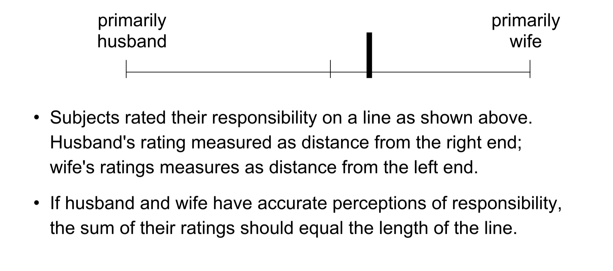

```{r setup, include=FALSE}
knitr::opts_chunk$set(echo = FALSE)
```

### What is Availability


## Example: Tversky and Kahneman (1973)

- Subjects saw a list of names, one at a time, that mixed 18 famous names and 19 non-famous names.

- There were two conditions that differed on whether the famous names were male or female. 

- The question each subject was asked: Did you see more men or more women?


```{r}

```

<br>
<center>
**What does the availability heuristic predict will happen?**
</center>
<br>


Famous names are more “available”. This is either because people can retrieve more of them or retrieve them more easily. 

Observe however that ease of recall and amount of recall are confounded in this experiment. This is a key distinction that the science of availability would later identify as having differential impact on frequency judgments

## Bias and Availability

**What are the factors that make an event easier to recall from memory?** 

Any factor not related to the actual event frequency is a source of bias. 


Availability biases are the consequence of non-frequency factors that influence memory encoding, retrieval, and mental construction. 

There are three basic patterns of bias we will consider:

## Sampling Bias

How do people assess risk?

Which is a more likely cause of death in the United States. Being killed by 

- falling airplane parts vs a shark? 
- lightning vs tornadoes?
- motor vehicle accident vs death from influenza or pneumonia

The mechanism for the biases is related to *media exposure*

Insensitivity to sampling bias (exposure bias) is not strictly a cognitive bias:

- The world feeds us biased information, ....

**The problem is that we have difficulty taking this into account and "unbiasing" our selective exposures.**

For example, things we all know:

- TV ads do not give an accurate picture of the value of products.

- Political spin doctors are trying to manipulate our beliefs.

- TV news is not a representative sampling of events.

- The portrayal of men/women, black/whites, rich/poor, gay/straight, on TV is not a representative presentation of these groups.

- Our own experiences are not typical of everybody’s experience.

- Etc.

We know that these information sources are biased, but can we 
correct for these biases or take them into account when forming beliefs?  Doubtful.

### Hamil, Wilson, & Nisbett (1980).

Subjects watch a video of an interview with a (fake) prison guard.  

**Humane tape**:  The prison guard is remarkably humane and compassionate. 

**Inhumane tape**:  The prison guard is brutal and cruel.  

**Condition 1**:  Subjects were given NO INFORMATION about the typicality of the guard.

**Condition 2**:  Subjects were told that the guard was TYPICAL 
                  of guards at that prison.

**Condition 3**:  Subjects were told that the guard was very ATYPICAL.


How do you think this table filled out? How should it have filled out?


Subjects predicted that most guards were consistent with the video tape (either humane or inhumane) without regard for his typicality. 


## Availability Cascades

> An availability cascade is a self-sustaining chain of events, which may start from media reports of a relatively minor event and lead up to public panic and large-scale government action. On some occasions, a media story about a risk catches the attention of a segment of the public, which becomes aroused and worried. This emotional reaction becomes a story in itself, prompting additional coverage in the media, which in turn produces greater concern and involvement. The cycle is sometimes sped along deliberately by ‘availability entrepreneurs,’ individuals or organizations who work to ensure a continuous flow of worrying news. The danger is increasingly exaggerated as the media compete for attention-grabbing headlines. Scientists and others who try to dampen the increasing fear and revulsion attract little attention, most of it hostile; anyone who claims that the danger is overstated is suspected of association with a ‘heinous cover-up.’ The issue becomes politically important because it is on everyone’s mind, and the response of the political system is guided by the intensity of public sentiment. The availability cascade has now reset priorities. Other risks, and other ways that resources could be applied for the public good, all have faded into the background.

##  Biased Sampling from Memory: Egocentric Bias

Ross & Sicoly (1979): 

- Subjects were 37 married couples.  

- Working separately, husband and wife rated self and spouse for their work on 20 activities:  

- Good Actions:  Making breakfast; cleaning dishes; cleaning house; making important decisions; ...  

- Bad Actions:  Causing arguments between themselves; making the house messy; irritating spouse; ....  




What actually happened


Why does it happen?


### Can we debias?

The experimenters first used a probability rating response, i.e., subjects gave numerical estimates of the percentage of time they did different activities.  The trouble with this is that the subjects would talk about their responses at the end of the experiment and get into arguments over who was right.  Having the subjects make their responses on a rating line made it harder for them to compare their responses, hence, preventing arguments among the subjects.  


It is very difficult to adopt the perspective of others.

The line visual makes it more apparent that the competing perspectives simply do not add up, and a cooperative debiasing is more likely. 


> I am generally not optimistic about the potential for personal control of biases, but this is an exception. The opportunity for successful debiasing exists because the circumstances in which issues of credit allocation come up are easy to identify, the more so because tensions often arise when several people at once feel that their efforts are not adequately recognized. The mere observation that there is usually more than 100% credit to go around is sometimes sufficient to defuse the situation. In any event, it is a good thing for every individual to remember. You will occasionally do more than your share, but it is useful to know that you are likely to have that feeling even when each member of the team feels the same way


## Ease of Recall

There is a confound in the original Tversky and Kahneman (1973) experiment: the amount of recall and the ease of recall were on and the same.

What drives the availability heuristic:

<br>
<center>
**Fluency of Recall** <br>
vs <br>
**Content of Recalled Memories**
</center>
<br>

aka System 1 vs System 2.

What did the The Schwarz experiments reveal?

> The conclusion is that the ease with which instances come to is a System 1 heuristic, which is replaced by a focus on content when System 2 is more engaged. Multiple lines of evidence converge on the conclusion that people who let themselves be guided by System 1 are more strongly susceptible to availability biases than others who are in a state of higher vigilance...Merely reminding people of a time when they had power increases their apparent trust in their own intuition

“I don’t spend a lot of time taking polls around the world to tell me what I think is the right way to act. I’ve just got to know how I feel” (George W. Bush 2002). 


