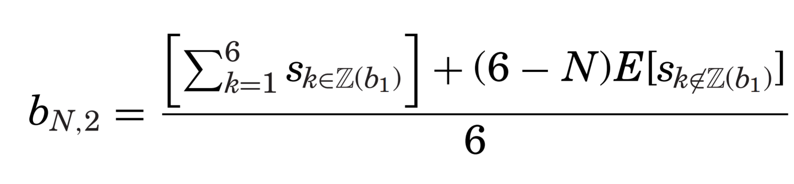

## Introduction to Paper

- News media and other information producers target users with signals that are related to prior beliefs. 

- We are thus exposed to **selected** information that can reinforce our own prior held views of the world. 

**Question: Can we debias ourselves when made aware of the selective nature of the information we are given?**

## Experiment

- Subjects are asked to predict an unobserved state $\theta$ which is the average of 6 random signals $s_{k}$ $$\theta = \frac{1}{6} \sum_{i=1}^{6}s_{i}$$

- Each **signal** $s_{i}$ is randomly drawn from the set $$X = \{50, 70, 90, 110, 130, 150\}$$

The structure and timing of events in the experiment is shown below 

- The binary guess $b_{1} \in \{low, high\}$ is whether the signal is smaller or larger than 100. 

- The continuous guess $b_{2} \in [50,100]$ is the final prediction. 

- The experiment is financially incentivized (e.g., incentive compatible).

## The Treatment Group

- The treatment group  is selectively shown information in the same direction as their initial belief $b_1$. 

- If $b_{1} < 100$, then only signals $s_{k}$ less than 100 are shown on the screen.  

- If $b_{1} > 100$, then only signals $s_{k}$ greater than 100 are shown on the screen. 

- Let $\mathbb{Z}(b_1)$ be the set of signals revealed to a subject and let $N = |\mathbb{Z}(b_1)|$ be the number of such signals. 

A fully rational Bayesian prediction that takes selection into account:

- **Question**: How to calculate $E\left[s_{k \notin \mathbb{Z}(b_1)} \mid b_1\right]$?

On the other hand a naive WYASTI prediction is given by

- An alternative departure is that selection effects are understood, but difficult to compute. 

An individual's prediction $b$ can be decomposed as a weighted average between the **Bayesian** and **WYSIATI** outcomes with weight $\chi \in [0,1]$.

- The control group is shown the "coarse" unobserved signals $E\left[s_{k \notin \mathbb{Z}(b_1)} \mid b_1\right]$. 

- The control group does not have access to better information, but less encouragement to use WYSIATI.

## Results

- Individuals in the treatment group exhibit significant selection effects, which are not readily mitigated with feedback. 

- The population distribution of $\chi$ is concentrated on two types: WYASTI ($\chi = 1$) and fully Bayesian ($\chi = 0$)

## Why does this happen?

Two potential hypotheses:

1. Unobserved signals do not come to mind: *WYSIATI* = $b_{N,1}$

2. Selection come to mind but heuristically computed: $b_{N,2}$.

The above experiment cannot distinguish because the predictions are nearly identical. 

He sets up another experiment

- What does this experimental design achieve?

- Under the second hypothesis, treatment and control should be identical. 

- The results suggest otherwise with a nearly identical population distribution of types as before:

## Can Market Design Help?

- The experiment then tries to nudge subjects to recognize selection.

- Nudging reduces neglect by about .2-.4 units of $\chi$.

## Conclusion

