# Bayes Rule

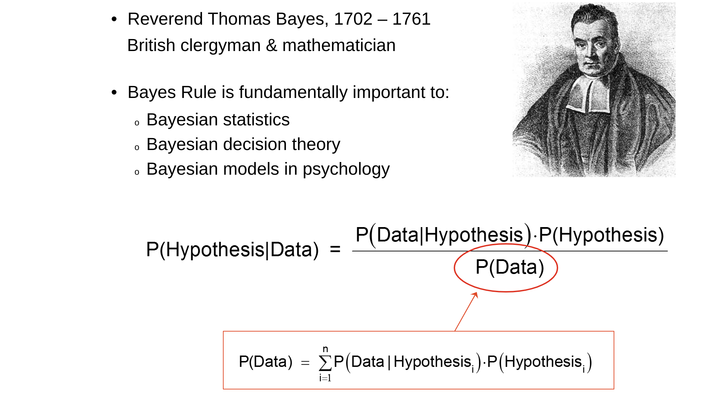

## Interpretation

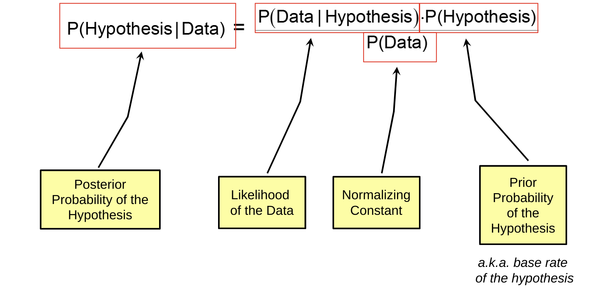

## Odds Formulation

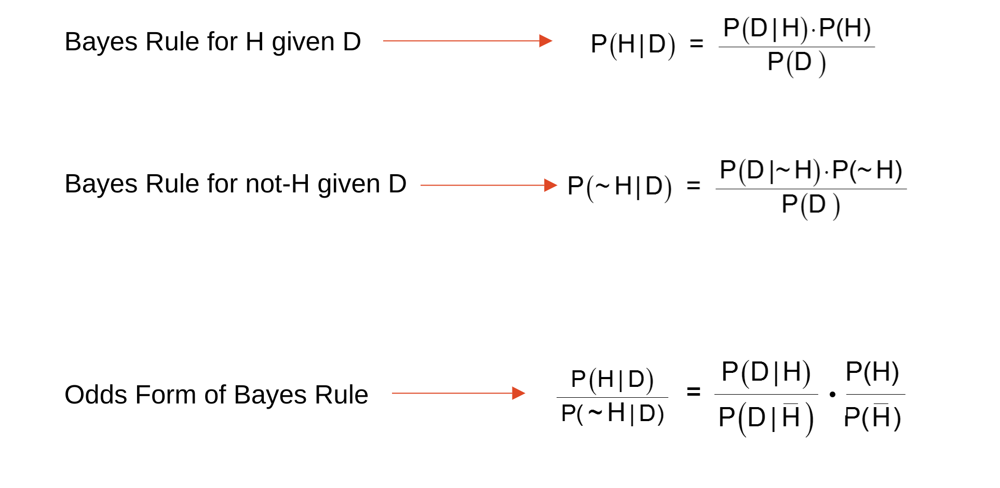

## Interpretation

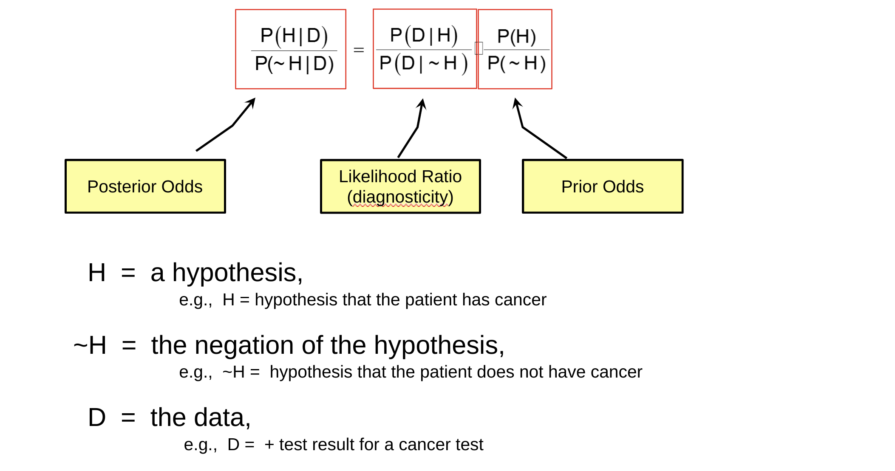

# Base Rate Neglect

## A Question

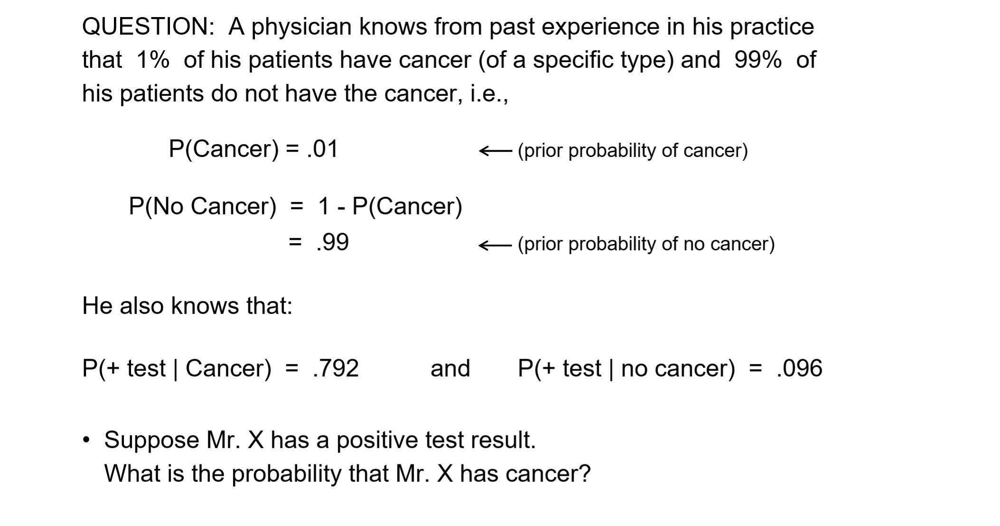

## Bayesian Analysis

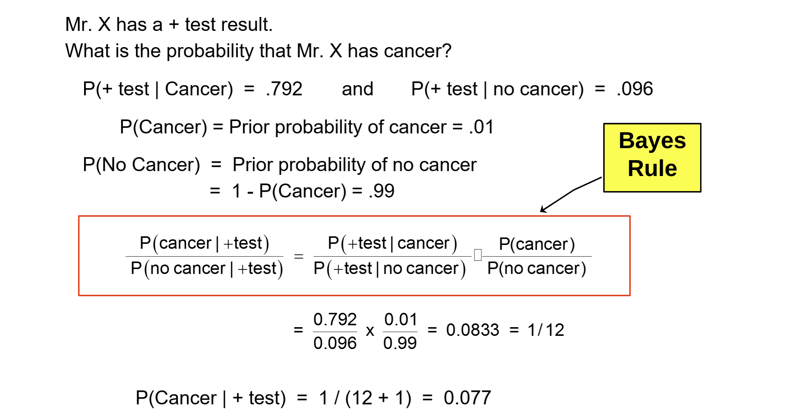

## Empirical Evidence

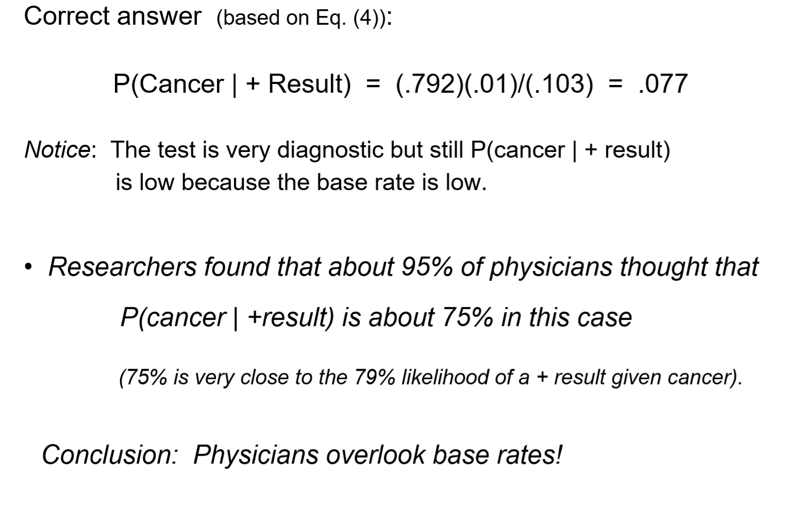

# Tom W

## The Description

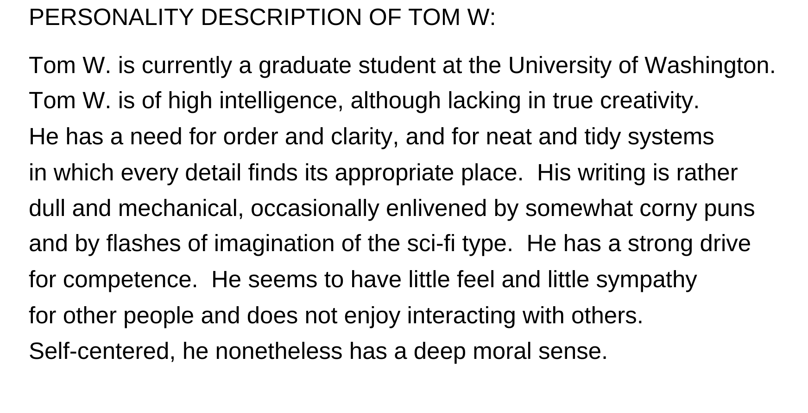

## The Task

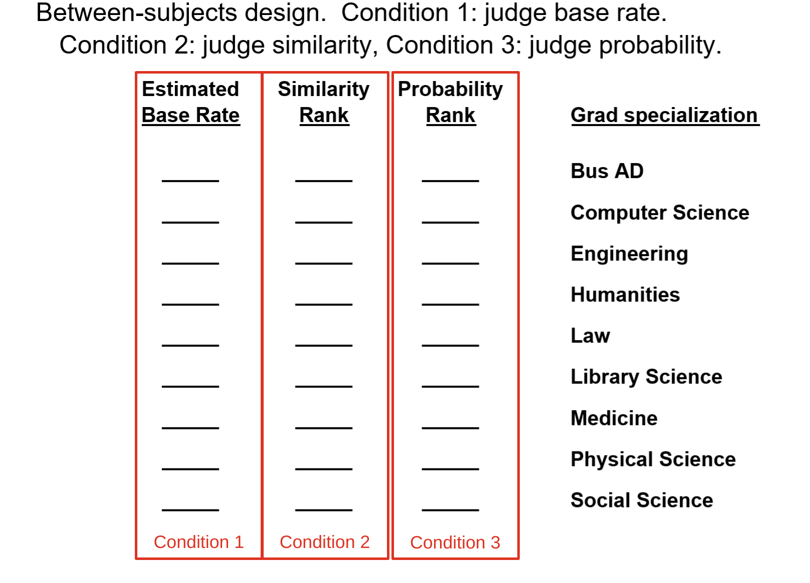

## The Findings

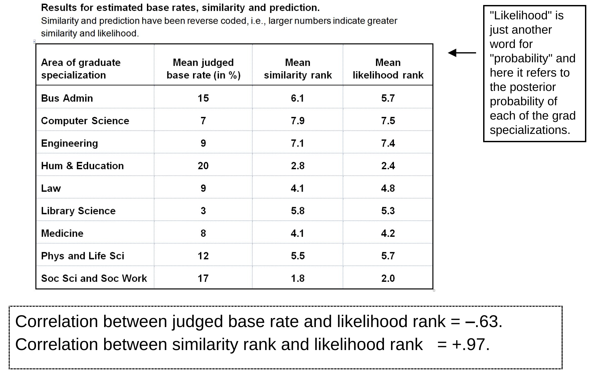

## The Interpretation

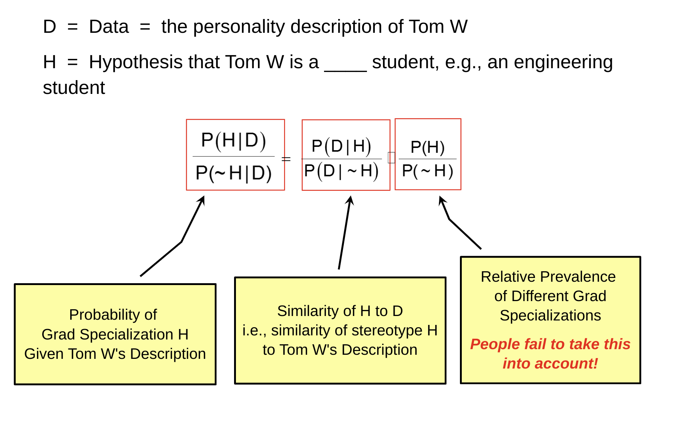

# Disciplining Intuition

>Intuitive impressions of the diagnosticiity of evidence are often exaggerated. The combination of WYSIATI and associative coherence tends to make us believe in the storeis we spin for ourselves. 

## Kahneman Advice

- Anchor your judgement of the probability of an outcome on a plausible base rate. 

- Question the diagnosticity of your evidence. 

## Discussion Questions on *Base Rate Neglect* Paper

1. What do you think would have happened had you *nudged* the subjects to "think like statisticians". Evidence from psychology literature (e.g., Norbert Schwarz) that individuals are motivated to take base-rate information into account, but not in a fully efficient way.

2. Activation of System 2 improves predictive acccuracy - frowning students perform better! System 2 knows the base rates are relevant but is *lazy* and ignores them (as oppsoed to not understanding the relevance of base rates). h

3. What are mental models? How can we manipulate them?

