## Statistical and Causal Reasoning

There are two important forms of reasoning in which we engage across both System 1 and System 2:

- **Statistical**: This arises when reasoning about the properties/regularities present in a broad population

- **Causal**: This arises when reasoning about specific instances of individuals/cases from the broader population. 

## Prediction problems

- Both modes of reasoning play a role in prediction problems. 

- A stylized information flow for a prediction problem goes as follows:
    - We must judge or form a prediction about an **attribute** $A$ of interest for a specific individual case from a population.
    - We have at our disposal certain information about the individual case we seek to predict, which we will call the **evidence** $E$.

## Attributes

- The attribute $A$ can be numerical, e.g., $A \in \mathbb{R}$
- The attribute $A$ can be categorical, e.g., $A \in \{1,\dots,c\}$ for $c$ possible categories. 
- A special case of a categorical attribute $A$ is a binary attribute, e.g., $A \in \{0,1\}$

## Statistical Reasoning

- Without any information or evidence $E$ on the individual case, the only reasoning we have availability is statistical, e.g., what is the frequency of the underlying attribute in the underlying population. 

- Let $P(A)$ denote the population probability of the attribute - sometimes called the *prior belief*, the *base rate*.

- If there is no other evidence $E$ given, then the best and only judgment about predicting the probability of observing the attribute for the individual is to treat the individual as a representative draw from the population. 

- We thus assign a judgment of $P(A)$.

## Causal Reasoning

- Now suppose we have access to information/data $E$ at the level of individual case we are forming a prediction. This is the evidence. 

- In many problems we can link the attribute $A$ and evidence $E$ through a chain of causal reasoning that goes from $A \to E$. 

- Our causal reasoning allows us to form an assessment of a **likelihood** $P(E \mid A)$, e.g., how likely would the evidence $E$ have been observed if the attribute $A$ was known. 

- Consider the role of the prior and likelihood in Tom W and the distinction between statistical and causal reasoning. 

## Bayes Rule

Bayes Rule gives us the optimal combination of statistical and causal information to predict the attribute $A$ from the evidence $E$. 

 

It is simplest to express in the case of a binary attribute $A$, in which case we will define

- $A$ = the attribute is present
- $\neg A$ = the attribute is not present

Bayes rule is conveniently expressed in posterior odds form

$$\underbrace{\frac{P(A\mid E)}{P(\neg A \mid E)}}_{\mbox{Posterior Odds}} = \underbrace{\left(\frac{P(E\mid A)}{P(E \mid \neg A)}\right)}_{\mbox{Likelihood Ratio}} \times \underbrace{\left(\frac{P(A)}{P(\neg A)}\right)}_{\mbox{Prior Odds}}$$

## Getting to a Prediction

- The formula lets us construct a *posterior odds* from the statistical and causal information we have at our disposal. 

- How do we get to an actual judgment about $P(A \mid E)$. 

- Suppose the posterior odds equals $d$. Then observe

\begin{align*}
P(A \mid E) + P(\neg A \mid E) &= 1 \implies \\
dP(\neg A \mid A) + P(\neg A \mid E) &= 1 \implies \\
P(\neg A \mid E)(d+1) &= 1 \implies \\
P(\neg A \mid E) &= \frac{1}{d+1}
\end{align*}

- Hence we have (from the first equation above)

$$P(A \mid E) = \frac{d}{d+1}$$

## Green Cabs and Blue Cabs

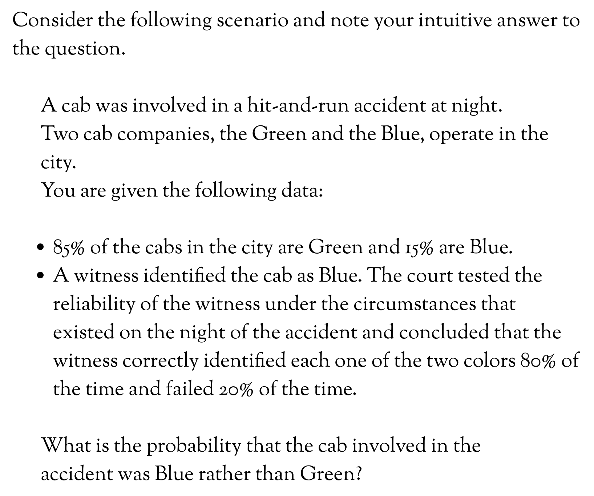

Lets break into groups and make sure we can reason through this problem via the mechanisms in Bayes rule. 

## Causes Trump Statistics

- The intuitive response to the question is to judge $$P(B \mid E) = P(E \mid B) = .80$$.

- Thus when presented with evidence $E$ on an individual case, only the evidence is taken into consideration for prediction of the individual case's attribute $A$. and statistical information is ignored. 

- Hence the expresssion **causes trump statistics** - when both causal information (via the likelihood) and statistical information (via the prior) are provided, the causal data receives all the weight in the judgment. 

- This is "intuitive" at some level but **wrong**. 

## Can We Acativate Statistical Thinking?

- Can we improve this outcome through designing the judgment problem differently?

- If *causes trump statistics*, then perhaps a solution is to present statistical information about the population in a causal light about the determinants of the individual case.

- That is, if we can coerce System 1 to draw an intuitive link between an individual case's membership to the broader group (the statistical population) as driver of the individual attribute, then presumably we can get base rate information to become incorporated into our fasat thinking. 

## Stereotyping

The mechanism to activate statitical thinking about the individual case is *stereotyping*.

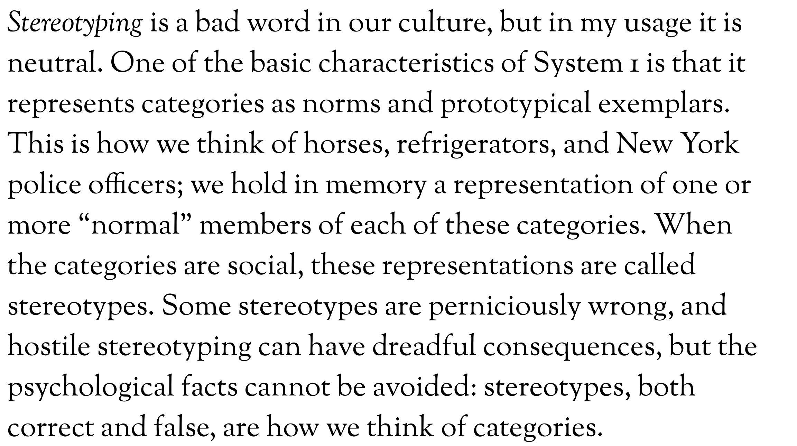

## Green Cabs and Blue Cabs revisited

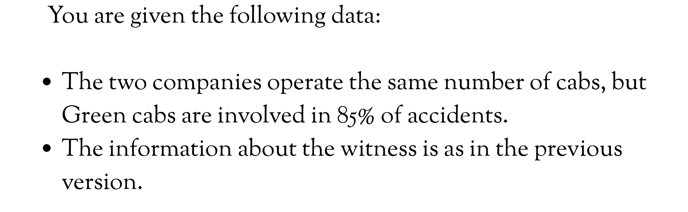

- What happens now?

- Why?

## What is explanation?

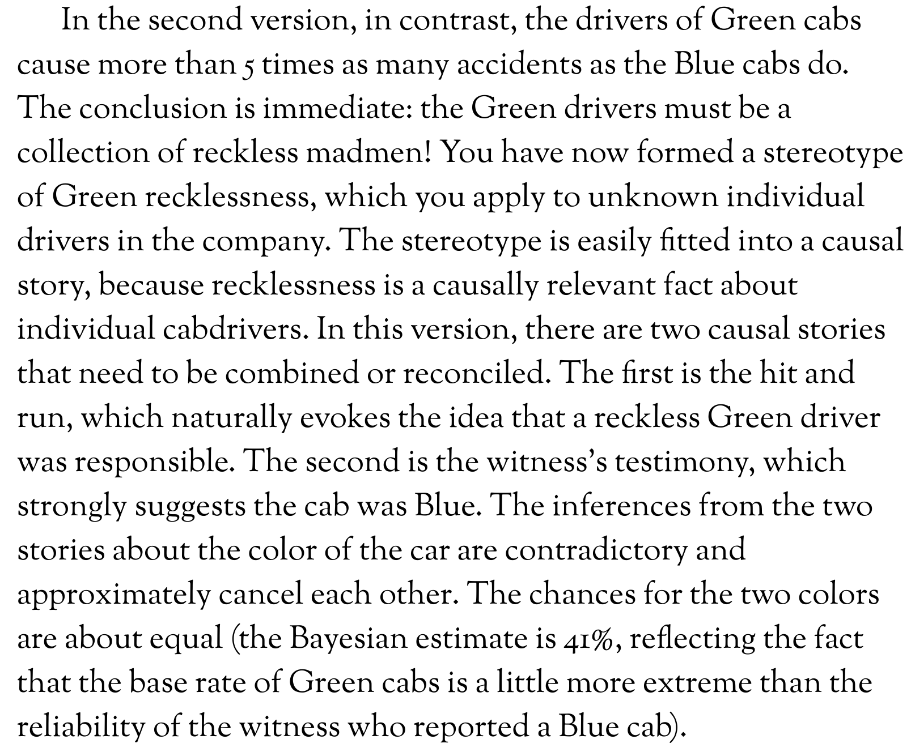

## Are Stereotypes all bad then?

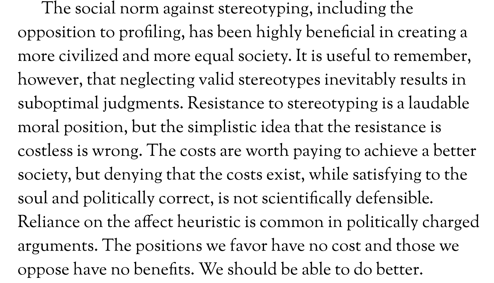

## Causal Base Rates

- Originated with the work of psychologist Icek Azjen

- Presented subjects with vignettes describing students who had taken an exam at Yale.

- Asked to judge probability that student passed. 

- Evidence $E =$ vignette, attribute $A =$ passed, and causal link is $E \to A$. 

- Causal base rates presented via describing the class from which student took exam as having a passing rate of $75\%$ or $25 \%$.

- What is the "causal" inference that is drawn depending on which class type a student was selected?

- Is base rate info taken into account?

## Can we shut-off the causal base rate?

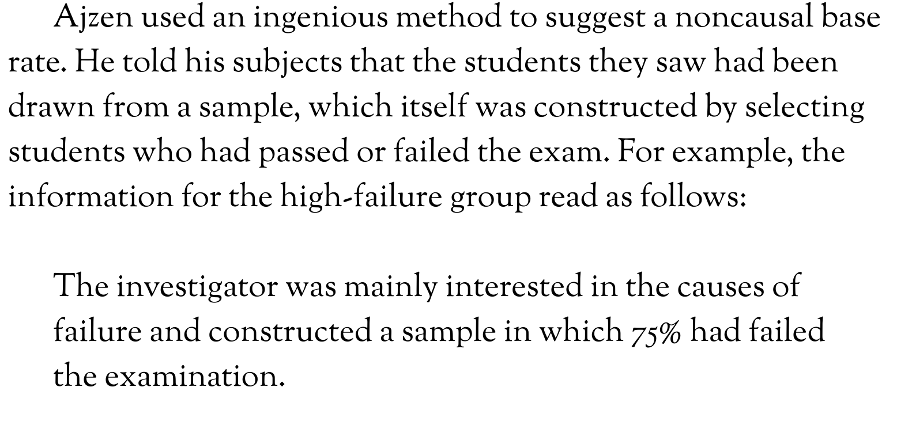

What happens now?

## Causal Base Rates are Not Enough Sometimes

- The Nisbett and Bordega experiment from University of Michigan

- aka "Learning psychology is a waste of time"?

## The Helping Experiment

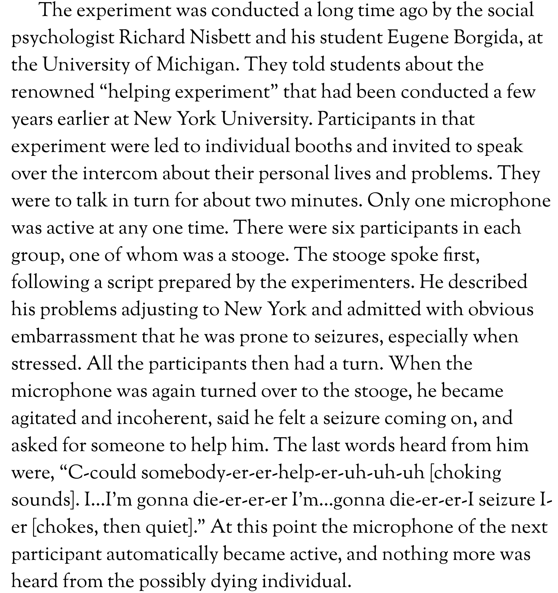

## The Finding

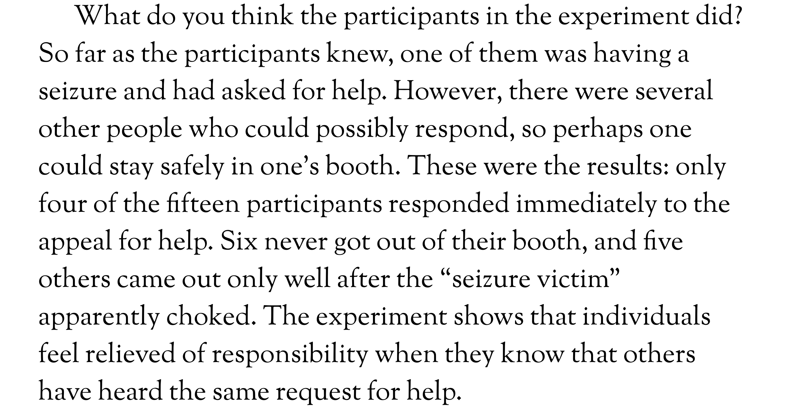

## Have we Really Learned Anything?

 Will your view of human nature change upon learning the causal insights from the helping experiment? 

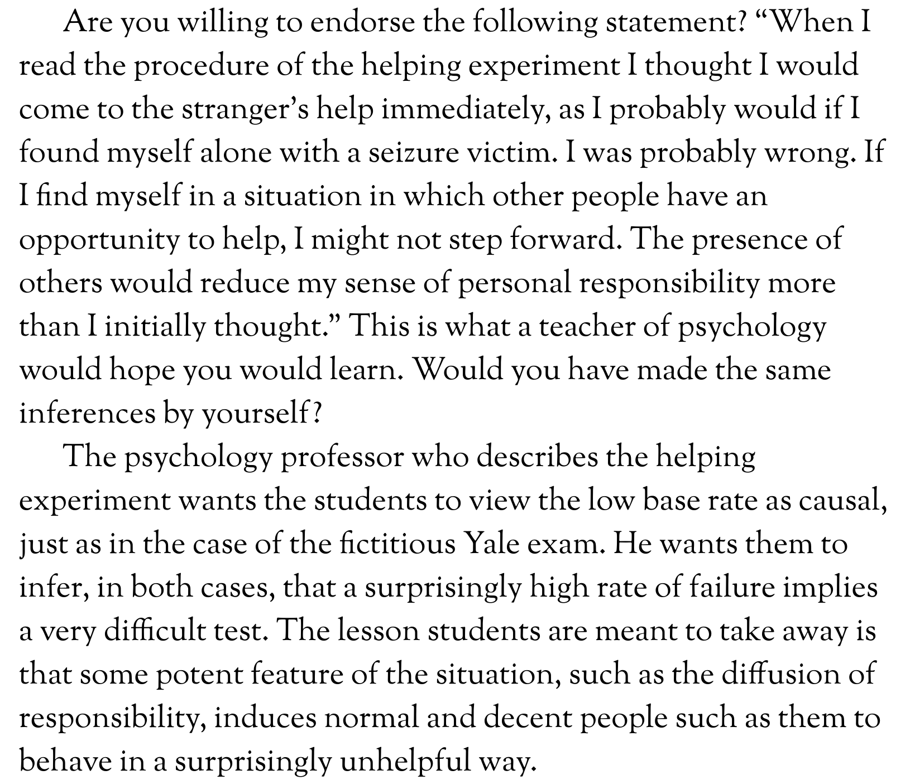

## The New Question

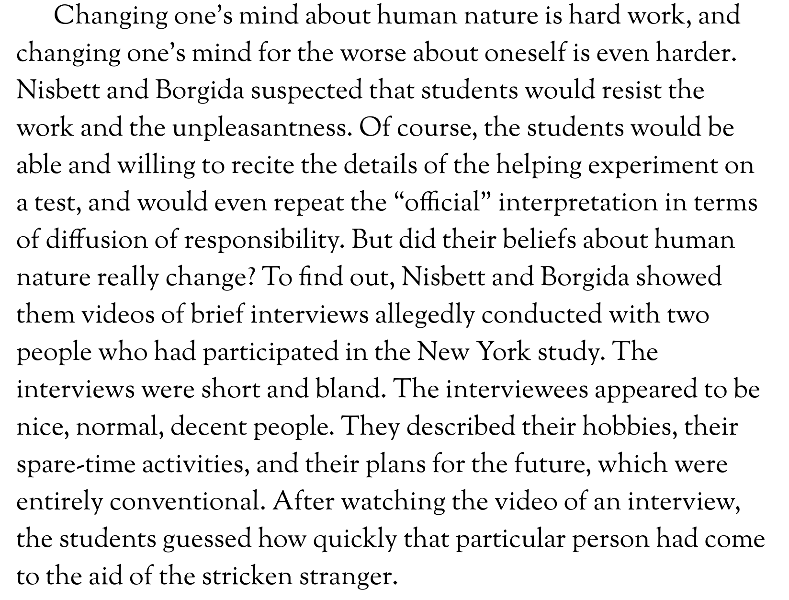

## The New Experiment

- They asked two groups of subjects to watch the video and predict behavior for the two individuals from the video. 

- In one group, they were told the results of the helping experiment.

- In another group, they were not told the results of the helping experiment. 

- The evidence is the same in both groups, but how should the base rates differ?

- What shoudl happen?

- What actually happened?

## Implications

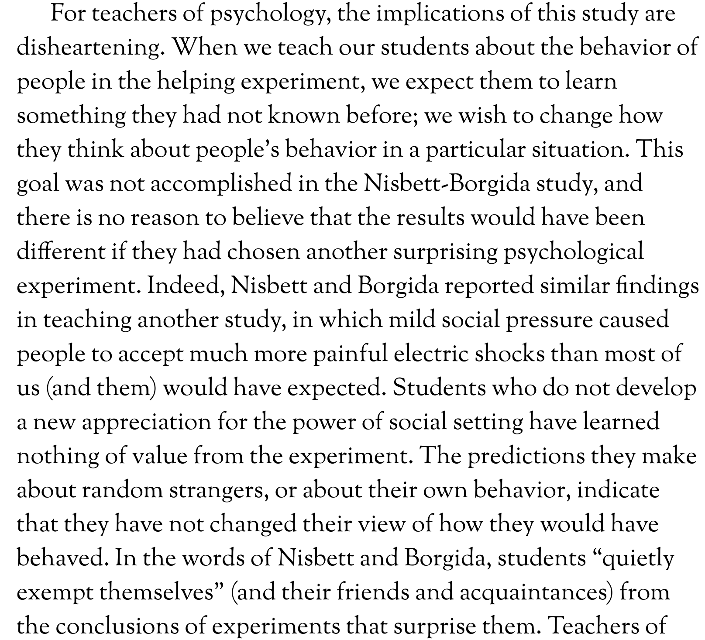

## The Twist

- They consider one more treatment

- Instead of telling subjects about the group outcome and asking them to predict the individual cases, they revealed the behavior of the individual case and asked them to predict the group behavior. 

- Suddently now - the group predictions were extremely accurate!

## The Lesson

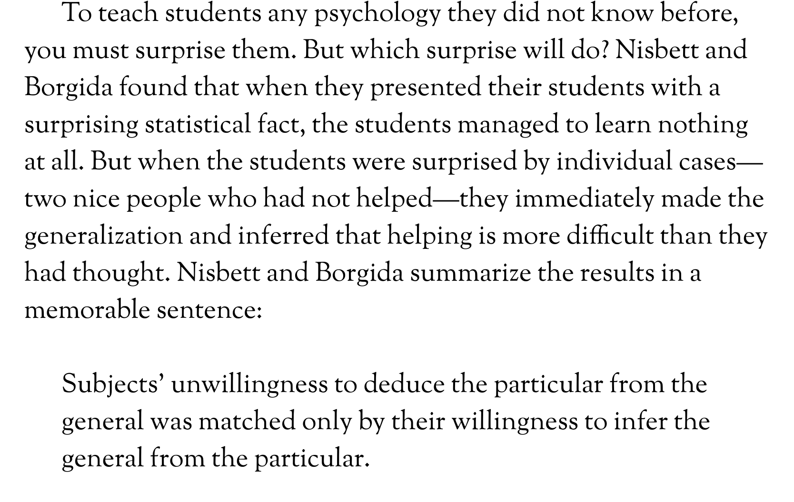

## The Final Takeaway

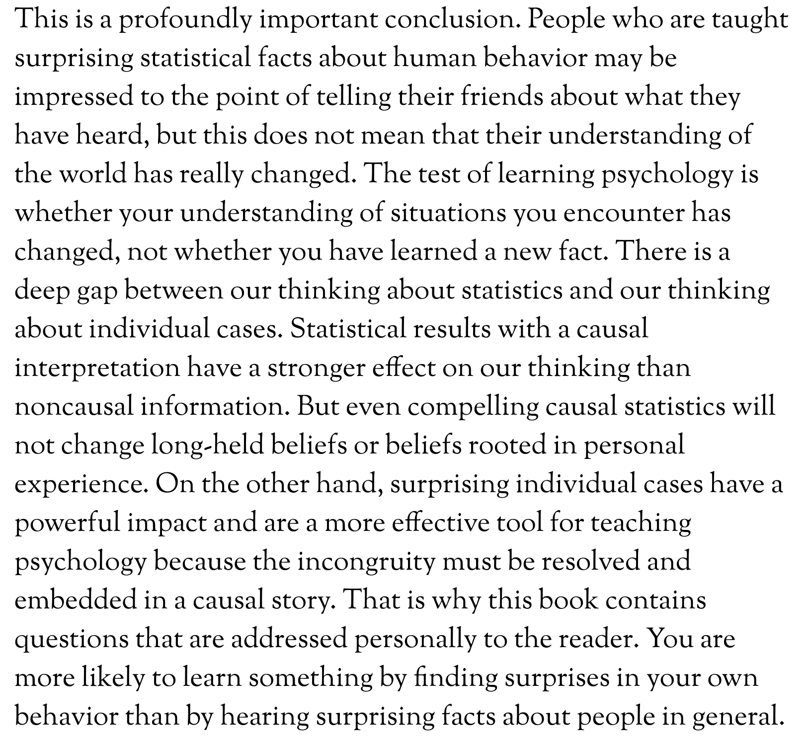

