```{r setup, include=FALSE}
knitr::opts_chunk$set(echo = FALSE)
```

## Statistical Setup

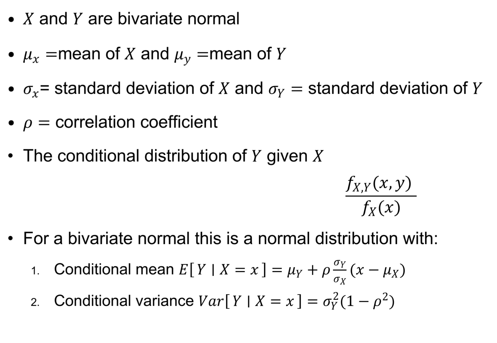

## Some rearrangement

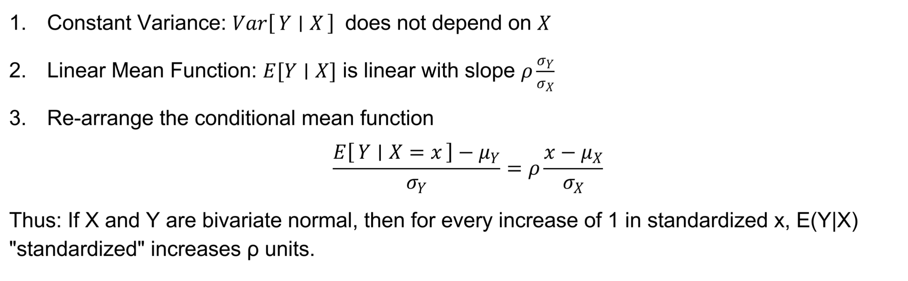

## Regression to the Mean

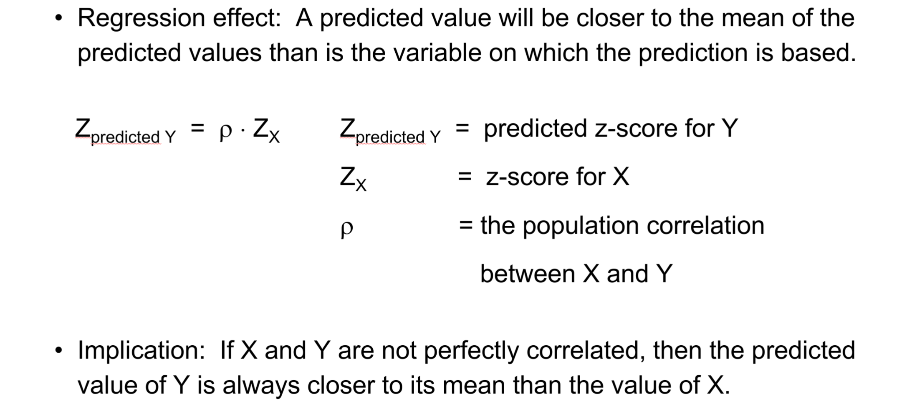

## Kahneman's Formula

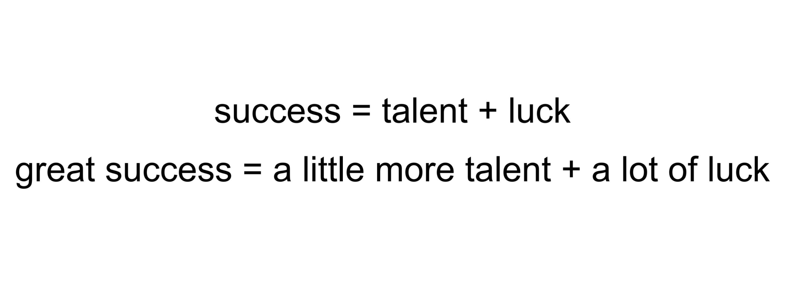

## System 1: Non-Regressive Predictions

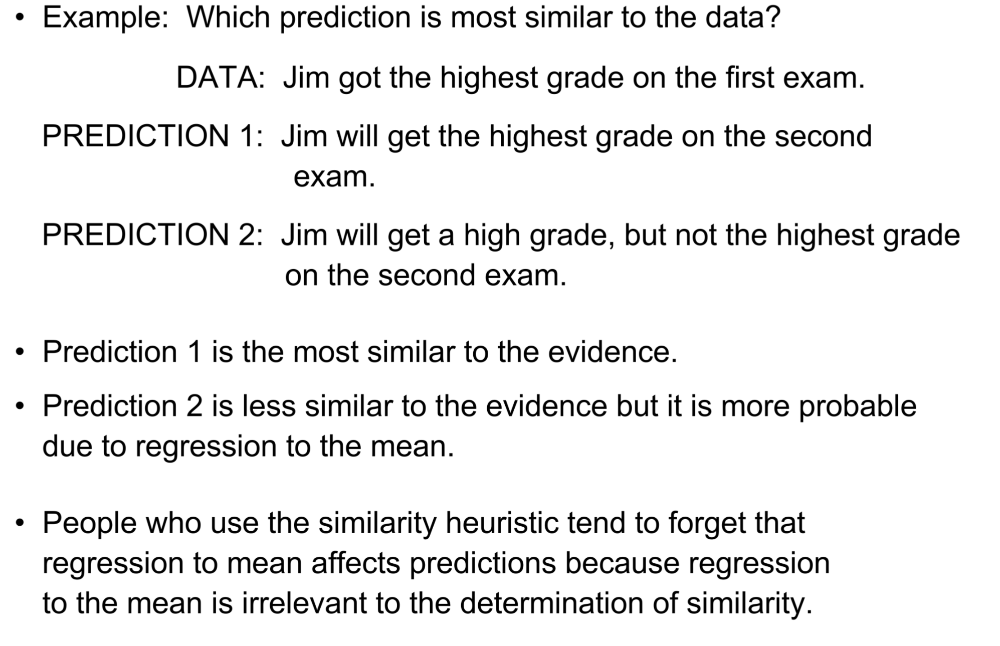


## An Example

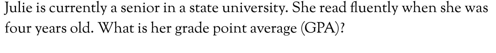

## What Happens

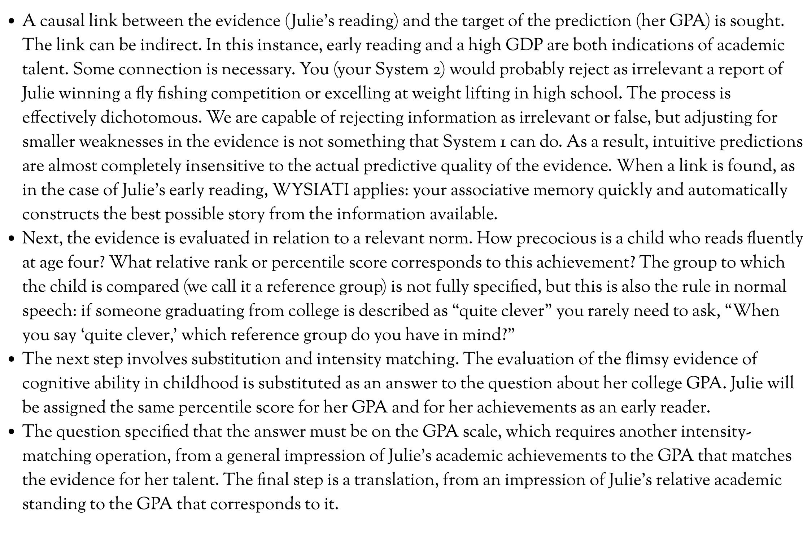

# Taming Intuitive Predictions?

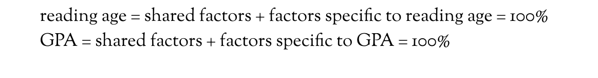

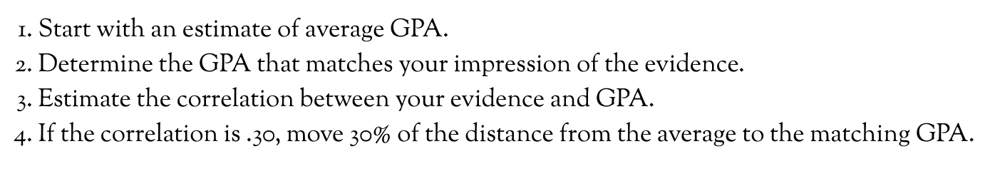


## To Tame or Not to Tame?

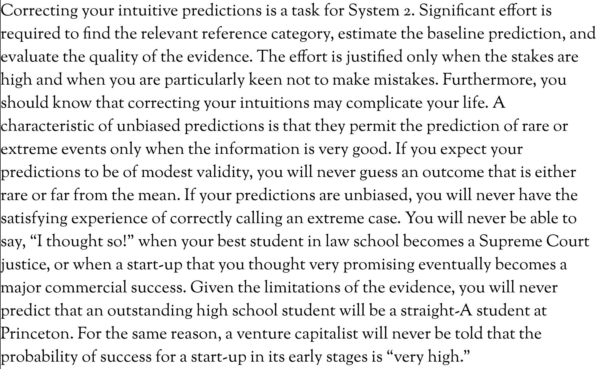

## A Final Example


## Broader Implications

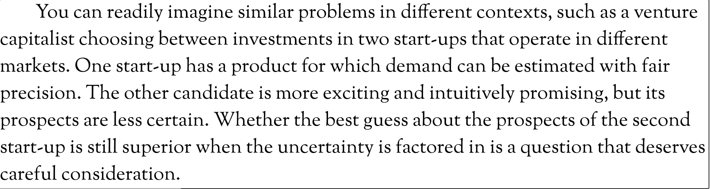