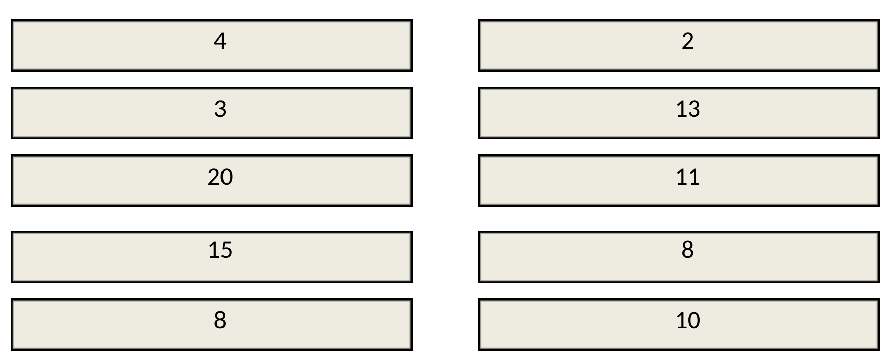
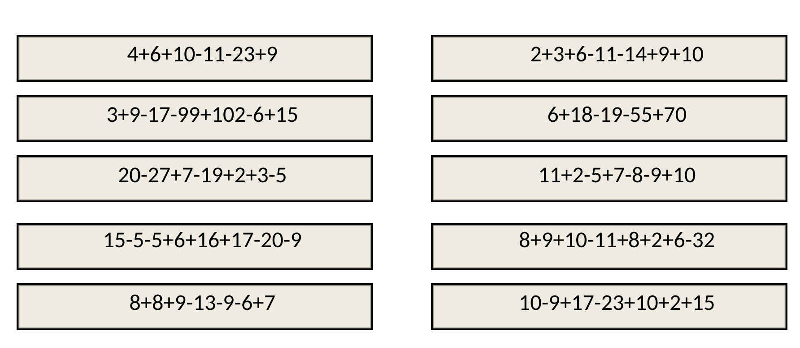
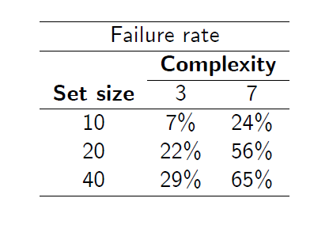
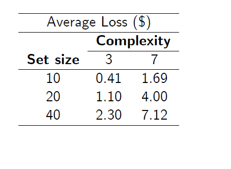
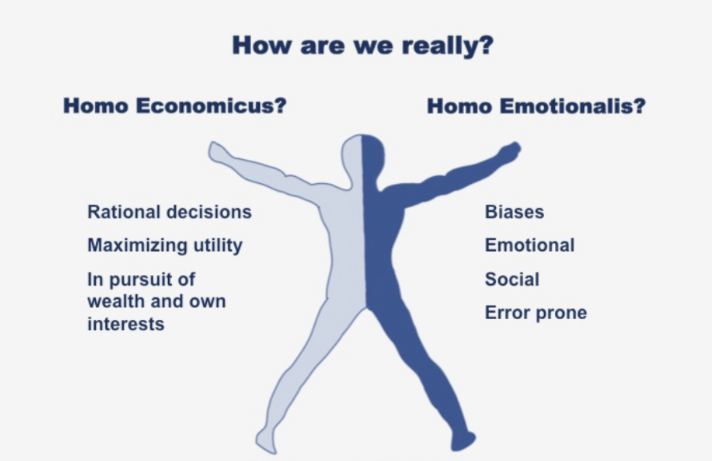

```{r setup, include=FALSE}
knitr::opts_chunk$set(echo = FALSE)
library(dplyr)
library(flair)

# Learn more about creating blogs with Distill at:
# https://rstudio.github.io/distill/blog.html

```

# Introduction

<!-- Who is Homo Economicus and Why Should Data Scientists Care? -->

<!-- The working title of the class: "Market Design for Economic Decisions". In the first lecture we will make the case for this course name in relation to the key problems we aim to tackle. -->

<!-- A key motivation for the course is given by the memorable quote: -->

> Life is a matter of choices, and every choice you make makes you.
> 
> ---John C. Maxwell

Economics is the science of choices - choice under scarcity specifically. Of course given that all choices involve an *opportunity cost* - the value of your next best alternative to the choice that was actually made - all choices are made in the presence of scarcity. Or said another way, in the words of a famous economic theorem you have likely heard -  **there is no free lunch**!^[The choices are made by a set of *economic actors* whose decisions interrelate to give rise to the fundamental economic outcomes in society. This includes what gets produced, how is it produced, and who receives it. The underlying actors themselves encompass consumers/households, firms/organizations, governments, and the market mechanism itself - e.g., the invisible hand.] 


The way economics approaches this science is actually a little quixotic and takes some time to appreciate the angle of attack. In order to understand the choices made by actual people in an economic system, an economic model will typically start with asking what may seem like an unusual question: *what would a hypothetical rational actor choose under the circumstances faced by actual person or entity making the choice?* 

Notice that this is distinct from asking : "what would the actual person or entity in question choose?". The reason for the difference is that the "rational actor experiment" - embedding a hypothetical rational actor in the setting faced by an actual decision maker - provides insight into the major forces that determine the outcome of the decision. By mapping the cause and effect relationship from decision forces to behavior, it enables economists to predict what different decisions could result as those forces are altered. 

A key force of interest in economics are incentives. Hence the rational actor is not meant to be a perfect replication of the entity in question in question making the decision, but rather a model that provides an approximation and is designed to **isolate the effect of incentives on behavior**. 

This actor interestingly enough has a name: `Homo Economicus`. It is a whole species of humanity that abides by the axioms of rational choice!

***

<center>


</center>

***

## (Re-)Introducing Homo Economicus

If you don't remember your Homo Economicus, lets have a quick refresher. Consider the list of options below which represent potential payoffs from choosing that option. Which option would you choose.  

```{r, echo=FALSE}

```

The answer should likely jump off the page. The option **20** feels (and indeed is) the highest payoff, and given that all else equal you prefer more to less, you choose it. 

If you have chosen in this fashion, there is a **Homo Economicus** living inside of you. You have entered a choice situation with a clear objective - maximize payoff. Yo also likely delibratively considered each option and assessed the one which best fulfilled your objective. In other word, you have just maximized the utility subject to a budget constraint - a key capability of Homo Economicus!

### How did Homo Economicus evolve?

Homo Economicus was historically discovered not through laboratory experiments, but rather through a process of human introspection. A collection of scholars spanning multiple fields - ranging from  Economics, Mathematics, Statistics, Computer Science, Operations Research, as well as Psychology and Sociology and even Philosophy - have all contributed to the modern conception of Homo Economicus by asking a common question: How should a rational actor behave given the logical structure of a decision problem.

This introspective methodology created the basic DNA of Homo Economicus. This DNA has evolved from the 18th century enlightenment thought to the present day in a fashion akin to natural selection as a wider variety of decision problems confronted Homo Economicus. These problems arose from a practical need to solve economic questions as opposed to completely abstract undertakings - e.g., they were problems truly found in the wild of applied economics. 


Homo Economicus is thus a human creation - a model built by humans for humans to shed light and understanding on the human condition. 


### Lets try an Example


-  Decision Maker **Doris** who lives for two periods
 
- In each period she will receive some income.
    - In the first period does not know what income in second period will be
- In each period will spend money on two goods
    - Bourbon \(b\) or Yoga classes \(y\)
    - She has utility $u(b,y)$ from consuming these two goods in any period she consumes them
    
- Can borrow and save between periods at interest rate $r$, but cannot die in debt

- Our job (as economists) is to predict how Doris is going to behave
    -How much bourbon and yoga she will she consume in each period?
    -How much will she save?
- How would Homo Economicus solve this decision problem?


# Key Assumptions

- Doris makes optimal choices – i\.e\. maximizes her utility
- Doris’s tastes do not change between period 1 and 2
- Doris forms the correct expectations about income in period 2\, and makes choices based on expected utility
- The only thing that appears in Doris’s utility function is the amount of bourbon and yoga consumed
    -No ‘reference points’
    -Not other people’s consumption

- Doris makes optimal choices – i\.e\. maximizes her utility
- Doris’s tastes do not change between period 1 and 2
- Doris forms the correct expectations about income in period 2\, and makes choices based on expected utility
 The only thing that appears in Doris’s utility function is the amount of bourbon and yoga consumed
    -No ‘reference points’
    -Not other people’s consumption


### What are the traits of Homo Economicus


The core anatomy of Homo Economicus that has emerged in modern economics encompasses the following set of traits:

1.	Has stable preferences
2.	Maximizes utility
3.	Forms beliefs about uncertain outcomes satisfying laws of probability distributions (probablistic sophistication)
4.	Updates beliefs with new information through Bayes Rule
5.	Makes decisions under uncertainty according to the principle of expected utility
6.	Makes decision over time in accordance with Bellman's principle (dynamically consistent). 

These traits are able to mix and match together depending on the structure of the choice problem to give rise to a very general model of rational behavior that is highly adaptable to most decisions. One of the first skills taught to graduate students in economics is to build a Homo Economicus in problem sets and computer simulations and to observe its behavior!


## But You are Actually Homo Sapien

All of this is great for the economics profession by what does it matter to you. Consider the following variation of the choice problem we presented above. What choice would you make among the following options. 

```{r echo=FALSE}

```

This choice problem feels different and triggers a rather different thought process. It is harder and your conclusion is more uncertain although there is no uncertainty in the question. Likely you will start to do a few operations of addition which you full well understand how to do in theory but don't particularly enjoy in practice. You will grow slightly weary of this repetition (different individuals will have a different threshold for this pain), you will then resort to glancing through the patterns of the numbers in the numbers and "recognize" through an intuitive sense which is the highest payoff from among these based on this pattern. 

If you functioned in this way, then congratulations you are indeed human - i.e., Homo Sapien! Homo Sapien, unlike Homo Economicus, is governed by another "thinking and reasoning system" that allows you to quickly assemble data from the environment, make sense of it, draw conclusions, and make decisions in a fairly automatic fashion. This thinking system stands at the front line of many decisions you actually make. It is distinguished by its remarkable speed and fairly effortless operation. 

For Homo Economicus the two presentations of the decision problem yield the exact same choice - the the problems are logically identical becauset the choice options themselves are mathematically equivalent. However for Homo Economicus they lead us down different "thinking" pathway. The end result of the two pathways lead to materially different decisions. 

Consider the following data from an experiment conducted in 2011 by Caplin, Dean, and Martin (see [here](https://www.aeaweb.org/articles?id=10.1257/aer.101.7.2899)), they presented 22 Subjects with 657 choices analgous to the choices above but the choice problem varied among subjects in two key dimensions:

  - 2 complexity levels: 3 or 7 operations
  - 3 choice set sizes: 10\, 20\, 40 options

which gave 6 overall treatments. An example of a choice problem can be seen below:


The results of the study are found below:

```{r out.width=c('50%', '50%'), fig.show='hold'}


```
The outcome reveals a few key realities that will be central themes for us:

**1)** Homo Sapien falls short of the rational ideal of Homo Economicus - Homo Sapien is *boundedly rationality*. 
<br>

**2)** The more complex environment exacerbates the difference with considerable heterogeneity among individuals.
<br>

**3)** Homo Sapien's choices are however reasonably effective - we leave cash on the table, but the level of inefficiency experienced is perhaps acceptable given the onerous calculations that would have been involved. 

# What should be done?

Here is where our chief quandary will lie. 

Economists for the most part build fairly sophisticated models of Homo Economicus through data, theory, and econometric technique which are motivated by real world problems faced by actual economic actors. 

But at the end of the day you on the other hand are Homo Sapien. We are left with two options to then consider:

**Option A:** &nbsp; Economists should really be performing genetic engineering on Homo Economicus to look and act more like Homo Sapiens. In this way build more realistic models of human behavior. 

**Option B:** &nbsp; Homo Sapien should act more like Homo Economicus if indeed the latter is rational and no one is likely to dispute a basic desire to be rational. 

Both options are interesting and quite important - there is an opportunity to build more predictive/realistic economic models and at the same time guide Homo Sapien towards a state of heightened rationality in actual behavior. 

Yet neither option if tenable if the difference between Homo Sapien and Homo Economicus and Homo Sapien is due to the whims and randomness of passion. That is, if the dividing line between Homo Economicus and Homo Sapien is attributable to a third specimen of being - **Homo Emotionalis**.


```{r}

```

This point of view was the established wisdom in the social sciences for the better part of the 20th century. The relevant departures from rational choice where the outcome of emotional reactions to the environment - the behavior of Homo Emotionalis. 

Under this paradigm, the general predisposition towards Homo Economicus was the norm, with the countervailing influence of an emotions that leading to momentary but significant departures from the rational norm. 

Mathematically we can imagine a theory of behavior under this view of people that resembled:

$$
\color{blue}{\mbox{actual behavior} = \mbox{rational behavior} + \epsilon}
$$

where $\epsilon$ is a random factor that causes our real behavior to fluctuate from the tenants of rational choice. 

Under this model, our rational selves are at the center and the emotional perturbations are disruptions to the center. This model

This rational system of thought which you are capable of internalizing we will identify with a dimension of your brain following Kahneman as your "System 2". The other designations we can give System 2 are your deliberate, rational, and formal thought system. 

The view emerging from System 1 and System 2 is actually
$$
\color{blue}{\mbox{actual behavior} = \mbox{intuitive behavior} + \mbox{rational adjustmnet}}
$$


System 2 is your inner Homo Economicus. It can follow the precepts of formal reasoning and motivate action on that basis. It is however **lazy**. It takes cues from system 1. All else equal it would rather outsource its job to another complementary 
This intuitive system of thought we will represent as another dimension of your brain that (following Kahneman) will call "System 1". 

Now we recognize that System 1 and System 2 are both present at the moment we are making a decision. Our main text in the class - thinking fast and slow - will be focused on the dual operation of System 1 and System 2 and how they operate together in a rich interplay that guides human decisions to predictably depart from Homo Economicus. 


# A question

Why don't we just take classes in decision making to solve the problem?

